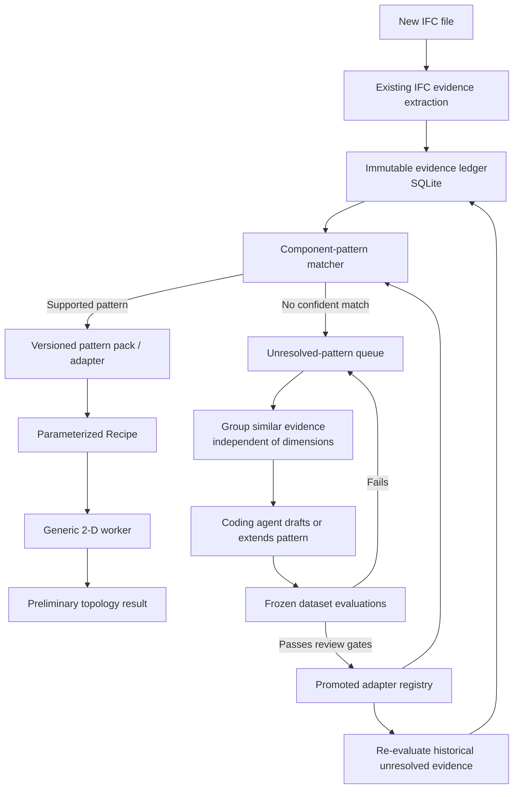

# IFC Evidence, Adapter, Dataset, and Evaluation Architecture

This scratch document records the proposed architecture for turning IFC evidence into reusable component-pattern packs and safely evaluating new adapters.



## Core rule

Coding agents may draft adapters offline, but newly generated code must not execute directly in a user calculation. It must pass the evaluation and promotion gates first. Until then, the product keeps the layer-only result and records an unresolved component opportunity.

## Reuse identities

| Identity | Includes dimensions? | Purpose |
| --- | ---: | --- |
| IFC hash | Entire source file | Provenance and duplicate-import detection |
| Evidence signature | Normalized IFC evidence | Group similar occurrences |
| Pattern ID | Shape, topology, and physics class | Select the reusable adapter |
| Recipe hash | Exact dimensions, materials, boundaries, and versions | Reuse an identical numerical result |

Different dimensions normally reuse the same pattern ID but produce different recipe hashes.

Example:

```text
repeating-metal-c-stud@1.0.0
  - 41 mm depth, 400 mm spacing
  - 75 mm depth, 600 mm spacing
  - 100 mm depth, 400 mm spacing
```

These are different recipe instances, not different adapters.

## Prefer pattern packs over new code

Most new components should be represented by a constrained, versioned pattern pack:

```json
{
  "patternId": "repeating-metal-c-stud",
  "version": "1.0.0",
  "recognition": {
    "materialTokens": ["steel stud", "metal stud", "montant métallique"]
  },
  "topology": {
    "module": "repeating-parallel-profile-wall-2d",
    "primitive": "standard.c",
    "rows": 1
  },
  "parameters": {
    "depth": { "sources": ["ifc", "label"] },
    "gauge": { "estimatedRangeMm": [0.6, 1.2] },
    "spacing": { "estimatedValuesMm": [400, 600] }
  }
}
```

An agent writes real adapter code only when existing pattern rules cannot represent the evidence, a new primitive is required, or a genuinely new topology module is needed.

## SQLite dataset records

The local dataset should contain separate immutable and derived records:

- `ifc_imports`: IFC hash, local location, parser version.
- `evidence_snapshots`: canonical extracted evidence JSON.
- `component_occurrences`: detected opportunities and normalized evidence signatures.
- `annotations`: human or agent labels stored separately from IFC evidence.
- `pattern_versions`: versioned pattern packs and adapter metadata.
- `pattern_matches`: selected pattern, confidence, and reasons.
- `recipe_instances`: exact recipes and recipe hashes.
- `solver_runs`: results, worker versions, and numerical evidence.
- `evaluation_runs`: dataset version, adapter version, metrics, and failures.

Large raw IFC files can remain in content-addressed local storage; SQLite stores their hashes and locations. Canonical evidence and evaluation records belong in SQLite.

## Agent workflow

1. Record an unmatched occurrence.
2. Group similar unresolved occurrences independent of dimensions.
3. Give the agent the whole cluster, not one IFC file.
4. Extend an existing pattern if possible; otherwise draft a new pattern pack or adapter.
5. Evaluate positive examples, near-neighbour negatives, varying dimensions, missing inputs, conflicting inputs, unsupported geometry, and real worker execution.
6. Promote only versions that pass the gates.
7. Replay the promoted version against historical unresolved evidence.

## Existing repository seams to reuse

- `src/domain/evidence/calculationInputEvidenceTypes.ts` — canonical IFC evidence payload.
- `src/domain/topology/ifcTopologyOpportunity.ts` — component opportunity detection and recipe confirmation.
- `src/domain/topology/componentKnowledgeBase.ts` — bounded unknowns and scenario generation.
- `src/domain/thermal-treatment/thermalTreatmentTypes.ts` — family adapter seam and versioned packs.
- `src/infrastructure/topology/python/kernel/compiler.py` — generic recipe compiler.
- `src/infrastructure/topology/python/topology_worker.py` — numerical worker.
- `src/infrastructure/persistence/sqlite/SqliteJobRepository.ts` — existing SQLite persistence pattern.

The first implementation slice should be an evidence ledger, one pattern pack, one real adapter, and a frozen evaluator that runs through the real worker.
