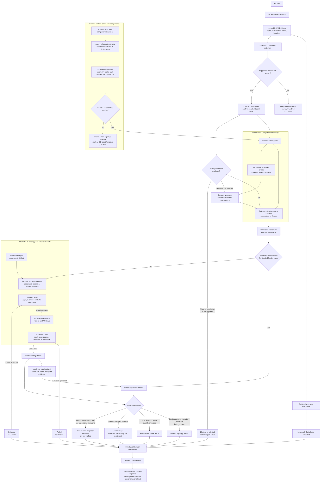

# Layer calculation versus repeating-component functions

## Ordinary wall-layer calculation

An ordinary wall layer is treated as a uniform one-dimensional slab. The
material covers the complete area, so heat is assumed to travel straight
through the ordered layers.

```text
outside -> insulation -> board -> inside
```

The calculation function consumes ordered layer datapoints:

- layer order;
- thickness;
- lambda;
- surface resistances;
- units and provenance.

It adds resistances in series:

```text
Rtotal = Rsi + sum(thickness / lambda) + Rse
U = 1 / Rtotal
```

This is appropriate when each layer is continuous and laterally uniform.

## Repeating non-layer component calculation

A repeating stud, girt, rail, or thermal break is not a full-area layer. It
creates multiple heat paths and lateral heat spreading:

```text
insulation | conductive member | insulation | conductive member
```

The component function should not directly invent a U-value. It should consume
IFC Evidence and reviewed values, then emit a deterministic Declarative
Construction Recipe containing:

- the host layer bands;
- primitive kind and version;
- member profile dimensions;
- spacing and row offsets;
- material references;
- cavity and explicit thermal-break regions;
- boundary conditions;
- authority and provenance for every value.

The shared 2-D topology module then:

1. places and repeats the member geometry;
2. subtracts and partitions host materials into non-overlapping Material Regions;
3. validates gaps, overlaps, contacts, slivers, and periodic faces;
4. meshes and solves the Representative Cell with the pinned Python worker;
5. checks refinement, residual, flux balance, and reproducibility;
6. returns the effective U-value and evidence.

```text
Ueffective = total heat flow / representative wall area / temperature difference
```

The units are the same as an ordinary U-value, but the physics is different.

## Function responsibilities

| Function | Responsible for | Must not do |
| --- | --- | --- |
| Layer calculation | Series resistance of continuous layers | Infer studs, spacing, or topology |
| Component recognizer | Suggest a supported pattern from IFC Evidence | Treat labels as geometry truth |
| Deterministic component function | Convert reviewed component parameters into a Recipe | Directly claim a U-value without validation |
| Primitive Plugin | Emit local profile geometry and capabilities | Own placement, repetition, solver, or trust classification |
| Generic topology compiler | Compose regions, contacts, periodicity, and audit | Contain family-name branches |
| Python numerical worker | Mesh, solve, and produce numerical evidence | Decide business trust or mutate Recipes |
| Scenario generator | Execute pack-defined credible parameter combinations | Invent unbounded defaults |
| Result cache/dataset | Reuse exact or validated parameterized results | Treat similar IFC labels as exact matches |

## Hash and reuse rule

An exact result is reusable only when the complete canonical Recipe and all
relevant module, registry, material-pack, worker, and solver identities match.
A same-family Recipe with different parameters may use a validated dataset or
run the real solver, but it is not an exact cache hit. Similar IFC evidence may
suggest a family only; it may not reuse a U-value directly.

## Complete architecture


