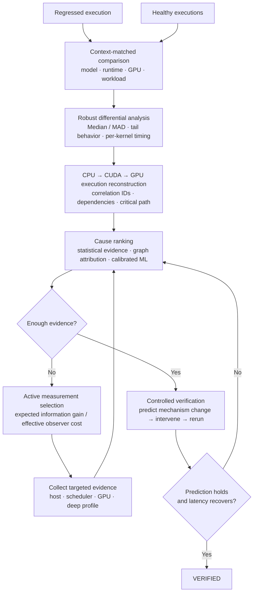

# Root

Find out why GPU inference got slower.

Root compares slow model runs with healthy ones to investigate what changed. It follows work from the CPU through CUDA to GPU kernels, the functions executed on the GPU, then ranks possible causes and chooses what to measure next.

The goal is a tested explanation: changing the suspected cause should produce the predicted effect and reduce total latency.

I built Root to investigate a problem relevant to Reflex: how much of the engineering work between “inference got slower” and a tested explanation can be automated? Requests can wait in queues, the CPU can be late submitting GPU work, and data transfers can delay computation. The component with the largest visible delay may be waiting on another component.

The prototype has two kinds of tests. A simulator exercises the full investigation process, including testing a cause and measuring recovery. Real SmolVLA runs on an NVIDIA T4 test whether Root can detect a slowdown and identify where timing changed. Those hardware runs record execution events and timings in files called traces.

[T4 results](#results-and-evidence) · [How Root works](#how-an-investigation-works) · [Run the simulator](#run-a-simulated-investigation)

## A regression the first detector missed

A stress run deliberately changes execution settings, adds competing work, or alters model inputs. We compare it with a healthy control to see whether inference, the model's computation of an output, became slower. That slowdown is an inference regression.

### How we created the stress conditions

For the first combined run, we replayed 250 SmolVLA frames on the T4 with these changes:

| Change | What it did |
|---|---|
| FP16 autocast | Let eligible operations use 16-bit arithmetic while keeping model weights in 32-bit format. This changed the arithmetic and kernels used. |
| `torch.compile` | Ran the model through PyTorch's compiler to test compiled execution. |
| cuDNN benchmarking | Allowed the library to try and select implementations of supported operations. We also relaxed deterministic settings. |
| Two background CPU workers | Repeatedly multiplied 256 × 256 NumPy matrices during measurement, competing for CPU resources while the host prepared and submitted inference work. |

FP16, compilation, and benchmarking can improve performance individually. We combined them with competing CPU work to test how the settings behaved together, then measured whether inference became slower.

### What happened

GPU inference time increased. The median is the middle measurement. The p95 value marks the time within which 95% of measurements finished.

| Device latency | Healthy control | Stress run | Recorded change |
|---|---:|---:|---:|
| Median | 3.94 ms | 9.94 ms | +152% |
| p95 | 7.07 ms | 23.3 ms | +230% |

### Why the detector missed it

The original detector grouped timings from different GPU kernels together. Those kernels normally take different amounts of time, so the variation between them hid the slowdown. The detector's highest stage score was only 1.34, assigned to transport rather than GPU execution.

We changed the detector to compare kernels with the same name across runs. The GPU anomaly score then reached **4.11**, while the healthy-control comparison stayed at **0.39**. The score expresses timing change relative to the comparison's variability: a larger value indicates a more unusual change. It has no time unit and is not a probability.

This experiment exposed and helped fix a detector bug. Root could now identify the GPU timing anomaly, but the combined settings did not reveal which individual change caused it. We did not demonstrate a fix that restored the workload's latency in this run.

The [trace inventory](workloads/smolvla/TRACES.md) records this experiment under `max-risky-colab-20260914-seed11`, run ID `20260913T224150Z-d783b2c1`. The detector is implemented in [diagnose.py](reflex/diagnose.py).

## Results and evidence

### What the larger stress runs added

The September 14 and 16 runs added these changes to the first setup:

- Used the compiler's `max-autotune` mode to try additional optimization choices.
- Alternated inference frames between two CUDA streams, or GPU work queues, sharing one model.
- Set PyTorch's CPU thread limits to one for work within an operation and one for work across operations.
- Replaced camera images with reproducible random noise and changed the task instruction to an intentionally conflicting instruction. This tested changed model inputs as well as changed execution settings.
- Disabled the TF32 arithmetic permission flags. We recorded this setting but did not measure its effect separately.

Each run used the short, 250-frame test workload. We collected traces in four parts to limit memory use. The exact settings are in the [combined-run script](scripts/smolvla_run_all10.py); the [replay code](workloads/smolvla/replay.py) implements the input changes and background workers.

These runs tested several changes together. Determining which change caused the slowdown requires tests that separate their effects. Because we also changed the images and instructions, differences in model output cannot be attributed to arithmetic precision alone.

### Recorded outcomes

The SmolVLA runs include healthy repeats, changes that stayed within the timing thresholds, and deliberately stressed executions. Percentages below are the rounded values recorded in the [trace inventory](workloads/smolvla/TRACES.md).

| Experiment | Timing result | Output comparison |
|---|---|---|
| Healthy repeats, 1,000 frames each | Medians 4.14 and 4.11 ms; p95 within roughly 5% | All 1,000 output hashes matched |
| First combined stress run | Median +152%; p95 +230% | No matching hashes across 250 outputs |
| FP16 versus FP32, 250 frames | Median +2.9%; no latency alarm | No matching hashes across 250 outputs |
| `torch.compile`, 250 frames | Median +2%; p95 +4%; within timing limits | All 250 output hashes matched |
| Larger stress run, September 14 | Median +207%; p95 +275% | Comparison with the healthy control pending |
| Larger stress run, September 16 | Median +177%; p95 +241% | Comparison with the healthy control pending |

An output hash checks whether the recorded output is identical. A different hash shows that the output changed, but does not tell us whether its accuracy became worse. The FP16 run illustrates why timing and output checks are separate: every output hash changed while latency remained within the accepted range.

The first stress run also tested the corrected detector: its GPU anomaly score was 4.11 versus 0.39 for the control. The larger runs establish further slowdowns; their recorded results do not verify a cause.

We used the healthy repeats to set acceptable timing variation for this evaluation: ±5% for the median and ±10% for p95. These limits apply to this setup. Initialization dominated the slowest measurements, so we recorded p99, the 99th percentile, without using it to decide whether a run regressed.

All latency figures in this table describe device latency. They do not measure a complete robot observation-to-action loop.

### Inspecting the evidence

- [SmolVLA trace inventory](workloads/smolvla/TRACES.md): run names, settings, collected files, source commits, and results.
- [SmolVLA runner](scripts/smolvla_run.py) and [larger stress-run configuration](scripts/smolvla_run_all10.py): workload collection code.
- [Replay implementation](workloads/smolvla/replay.py) and [trace replay tests](tests/test_smolvla_trace_replay.py): the workload and trace-processing path.
- [Separate T4 feature analysis](.scratch/reflex-tool/research/t4_feature_analysis.md), [per-run CSV](.scratch/reflex-tool/research/t4_feature_table.csv), and [fault-versus-healthy CSV](.scratch/reflex-tool/research/t4_fault_vs_healthy.csv): an earlier 36-bundle collection across 12 labels and three seeds. This is a separate experiment, not the source of the SmolVLA numbers above.

Individual SmolVLA traces are hundreds of megabytes, so we store them outside git. The inventory lists the files and results, but public downloads and underlying metrics files are not available for every run. Recalculating all the results requires access to those files.

## How an investigation works

The diagram shows the full investigation design. The sections below explain how each step works and which parts still require integration or hardware validation. Paper links identify the research behind specific mechanisms; they do not imply that Root reproduces each paper's complete system or guarantees.

### Check the healthy comparison

You supply the healthy run. For real traces, Root checks the timing-model version recorded with the data; in the simulator, it also checks workload and kernel context. Root refuses incompatible comparisons. It does not automatically find a baseline or check every hardware and software setting.

Root compares median timings and measures how far samples typically fall from the median, using median absolute deviation. It allows small timing differences and prevents nearly constant measurements from producing extreme scores for tiny changes. GPU comparisons match kernel names, as in the detector fix above.

### Use dependencies to interpret timing

Root builds a [graph of which CPU and GPU operations launch, feed, or wait for other operations](https://arxiv.org/abs/2608.01975), drawing on TELLER's cross-layer analysis. A [late kernel launch and a kernel that takes longer to run suggest different causes](https://arxiv.org/abs/2603.22774), even if both delay the result. Root combines these relationships with timing comparisons and statistical models to rank possible explanations.

Root records missing events and uncertain ordering rather than inventing links. It can [withhold a diagnosis when confidence is insufficient](https://arxiv.org/abs/1705.08500), following the selective-classification idea, and leave the cause unknown when the available explanations do not fit. Model scores guide the investigation; testing a cause still requires changing it and measuring the effect.

The confidence layer uses [temperature scaling](https://proceedings.mlr.press/v70/guo17a.html) to adjust predicted probabilities against labeled examples. It also includes [conformal prediction](https://arxiv.org/abs/2107.07511) as a benchmark for returning a set of possible causes.

### Choose what to measure next

When several explanations still fit, Root considers a CPU scheduling trace, a GPU kernel timeline, or hardware counters. It asks [which measurement would best distinguish the remaining causes](https://arxiv.org/abs/1207.1418).

When Root has a trusted model of possible measurement outcomes, it weighs the expected value of new evidence against [collection cost](https://arxiv.org/abs/1705.09879). It discounts [unreliable evidence and signals that repeat what it already knows](https://proceedings.mlr.press/v54/chen17b.html). Collection cost includes setup work and any slowdown caused by profiling itself. [Shared setup costs](https://arxiv.org/abs/2501.18010) matter too: once a profiling group is active, another measurement in that group can cost less to collect.

Root checks whether a measurement is available, permitted, and affordable within the remaining budget. When its predictions are unreliable or it assigns too much weight to unknown causes, it falls back to a simpler choice based on cost. Some profiler choices still need manual execution.

### Test a recorded prediction

Before changing the suspected cause, Root records what should happen. This follows the [causal-profiling principle of testing whether changing a component improves overall performance](https://arxiv.org/abs/1608.03676), explored in Coz. Root's verification rule requires the relevant measurements to move in the predicted direction and total latency to fall by at least half the predicted improvement. A faster rerun alone is insufficient if the expected change in the suspected component did not occur.

The investigation record distinguishes four states:

| State | Meaning |
|---|---|
| OBSERVED | A direct measurement was recorded |
| INFERRED | Current evidence supports a possible explanation |
| TESTED | A test changed the suspected cause |
| VERIFIED | The test produced the predicted effect and required reduction in total latency |

These tests run in the simulator. The T4 results above demonstrate timing comparisons, not this complete verification process.

## Current scope

Alongside the investigation steps above, Root can [keep recent events in a fixed-size buffer](https://www.usenix.org/conference/nsdi23/presentation/zhang-lei), inspired by Hindsight, account for profiling overhead, and retrieve earlier investigations. It [restricts detailed GPU analysis to cases that meet its evidence and budget checks](https://www.usenix.org/conference/osdi26/presentation/wu-haonan), drawing on StriaTrace's approach to selective tracing and diagnosis.

The next integration steps are to connect measurement selection to detailed GPU analysis, launch every supported external profiler automatically, and trace GPU kernels back through CUDA and framework operations to Python code.

Learning from past investigations to choose measurements and decide which events to keep is planned work.

We have not yet shown that the results hold on other GPUs, that Root can separate every combination of simultaneous faults, or that it reduces an engineer's debugging time.

## Run a simulated investigation

The project is named Root; the Python package is still named `reflex`. From the repository root, install the [dependencies](requirements-t4.txt) and run the demo:

    python -m pip install -r requirements-t4.txt
    python -m reflex demo --out demo-out

The demo prints a simulated investigation report. To evaluate Root against faults whose identities are hidden from the investigator, run:

    python -m reflex eval --out eval-out

The evaluation reports how often the correct cause ranked first or in the top three, how many cases reached VERIFIED, the measurement count, and elapsed time. These commands run simulated tests; they do not reproduce the SmolVLA hardware measurements.

To render an existing investigation, supply its ledger, incident ID, and summary:

    python -m reflex show-me --ledger <ledger.jsonl> --incident <id> --summary <summary.json>

For the real-workload collection path, start with the [SmolVLA runner](scripts/smolvla_run.py) and [trace inventory](workloads/smolvla/TRACES.md).

## Research and implementation

I developed Root over three weeks, using agents to screen more than 3,000 papers on debugging, collecting execution data, GPU profiling, and testing suspected causes. That work helped me choose how Root compares runs, selects measurements, and tests explanations.

The [project and architecture notes](reflex-project-notes.md), paper indexes for [Program A](program-a-paper-master.csv) and [Program B](program-b-paper-master.csv), and [paper-screening records](pass2/) document that research. The results section records what we have tested so far.

| Code | Responsibility |
|---|---|
| [collect.py](reflex/collect.py), [adapters.py](reflex/adapters.py) | Read traces and convert them into a common format |
| [diagnose.py](reflex/diagnose.py), [reconstruct.py](reflex/reconstruct.py) | Compare timings and connect dependent operations |
| [tournament.py](reflex/tournament.py), [confidence.py](reflex/confidence.py), [calibrate.py](reflex/calibrate.py) | Combine model scores, rank causes, and calibrate confidence |
| [select.py](reflex/select.py), [deep.py](reflex/deep.py) | Measurement selection and deeper GPU analysis |
| [ledger.py](reflex/ledger.py), [verify.py](reflex/verify.py) | Evidence states and controlled verification |
| [runtime.py](reflex/runtime.py), [memory.py](reflex/memory.py) | Keep recent execution events and retrieve past investigations |
| [tests/](tests/) | Regression and contract tests |
