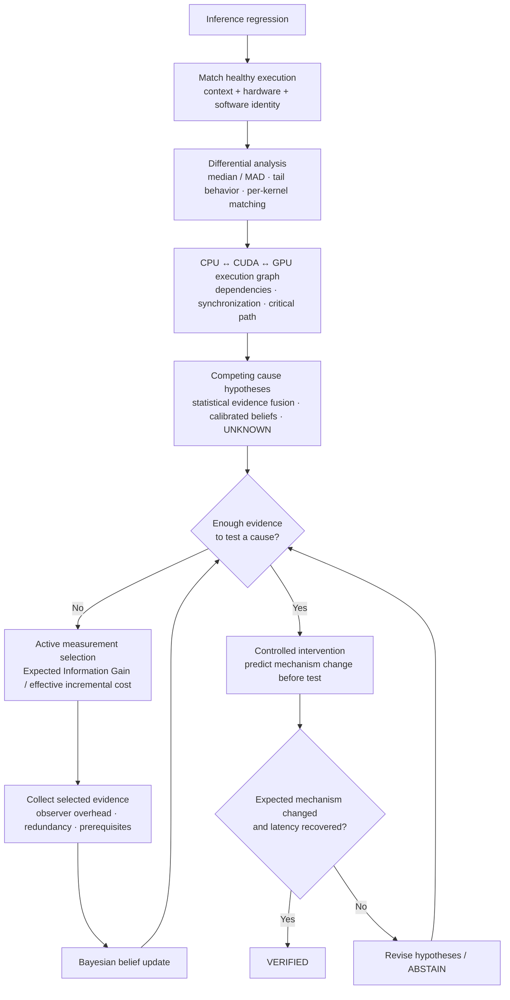

# Reflex Runtime Latency Diagnosis

**An autonomous investigator for GPU inference regressions.**

When inference suddenly gets slower, the root cause can be buried across host submission, synchronization, queueing, data transfers, GPU kernels, memory layout, contention, and runtime behavior. The slowest-looking component is not always the cause.

Reflex investigates the regression instead of only producing profiler output. It compares a bad execution against healthy runs, reconstructs the CPU-to-GPU execution path, combines multiple diagnosis methods, keeps competing causes alive, chooses the next useful measurement, and verifies a suspected cause with a controlled test.

## How it works



The loop is deliberately selective: **compare → localize → reason → choose evidence → update → test → verify**. Expensive profiling is collected when it is expected to resolve diagnostic uncertainty, not by default.

### Core mechanisms

- **Matched healthy comparison** — compares incidents only against compatible healthy executions and measures differential behavior rather than absolute timing alone.
- **Robust statistics** — median/MAD-based comparisons and matched per-kernel GPU timing reduce sensitivity to outliers and heterogeneous kernel distributions.
- **CPU → GPU execution reconstruction** — uses execution structure to separate upstream causes from downstream symptoms.
- **Multiple diagnostic models** — combines differently biased signals rather than trusting one classifier or heuristic.
- **Explicit uncertainty** — keeps multiple possible causes and preserves `UNKNOWN` when the evidence does not support a confident diagnosis.
- **Active measurement selection** — uses expected information gain relative to effective measurement cost to decide what evidence is worth collecting next.
- **Observer-aware cost** — profiler overhead and measurement perturbation are part of the decision cost rather than treated as free.
- **Evidence levels** — findings progress through `OBSERVED → INFERRED → TESTED → VERIFIED`.
- **Intervention-gated verification** — a diagnosis becomes `VERIFIED` only when a controlled test changes the predicted mechanism and measured latency recovers.
- **Incident memory** — previous investigations can be retrieved as structured evidence and priors without replacing current-run measurements.

## Real GPU results

The system has been exercised on **SmolVLA inference running on an NVIDIA T4**, with real PyTorch/CUDA traces. Full trace files are kept outside git because individual captures are hundreds of megabytes; [`workloads/smolvla/TRACES.md`](workloads/smolvla/TRACES.md) is the committed trace and provenance index.

### Healthy baseline

Two 1,000-frame healthy SmolVLA runs produced **bit-identical outputs**, device-latency medians within roughly **1%** (4.14 ms vs 4.11 ms), and p95 within roughly **5%**.

### Large latency regression

| Metric | Healthy | Regressed | Change |
|---|---:|---:|---:|
| Median device latency | 3.94 ms | 9.94 ms | **+152%** |
| p95 device latency | 7.07 ms | 23.3 ms | **+230%** |
| Matched GPU anomaly | 0.39 control | 4.11 | strong trip |

The regressed run also produced different outputs from its FP32 control. The matched per-kernel GPU comparison isolated a strong GPU timing anomaly while the healthy control remained quiet.

### Correctness regression without a latency regression

An FP16 SmolVLA run produced **0/250 identical output hashes** versus its FP32 control while median latency changed only **+2.9%**, inside the healthy timing band. The latency diagnosis remained quiet rather than forcing the incident into a latency cause.

### Replication

Two larger SmolVLA stress configurations reproduced substantial timing regressions on T4:

- **+207% median / +275% p95** — September 14 run.
- **+177% median / +241% p95** — September 16 run.

A separate `torch.compile` run stayed inside the healthy thresholds with identical outputs, providing a negative control rather than treating every runtime change as a regression.

## Evidence model

Every investigation is backed by an append-only typed evidence ledger. The system distinguishes what it observed from what it inferred and what it actually tested:

```text
OBSERVED   telemetry directly measured from the execution
    ↓
INFERRED   diagnosis supported by current evidence
    ↓
TESTED     a targeted intervention was executed
    ↓
VERIFIED   predicted mechanism changed and latency recovered
```

The language model, when used as an orchestrator, is not the source of truth. Telemetry, statistical comparison, execution dependencies, profiler evidence, and controlled experiments are.

## Research basis

The architecture was developed from a broader review of systems and ML research spanning:

- active diagnosis and sequential measurement selection;
- uncertainty, calibration, and abstention;
- CPU/GPU execution tracing and critical-path reasoning;
- GPU kernel, source, stall, and tensor-level diagnosis;
- incident retrieval and structural memory;
- causal verification through controlled interventions.

The repository includes the research corpus and project notes used to derive and compare candidate mechanisms. The final design intentionally combines a small set of mechanisms rather than reproducing any single paper.

## Repository map

```text
reflex/                  diagnosis, confidence, evidence, memory, collection
workloads/smolvla/       real SmolVLA workload + T4 trace inventory
colab/                   GPU workload / Colab entry points
scripts/                 collection, evaluation, and experiment runners
tests/                   regression and contract tests
reflex-project-notes.md  research and architecture notes
```

## CLI

The package currently exposes three top-level commands:

```bash
python -m reflex show-me --ledger <ledger.jsonl> --incident <id> --summary <summary.json>
python -m reflex eval --out eval-out
python -m reflex demo --out demo-out
```

`show-me` renders one investigation from the evidence ledger. `eval` runs the hidden-fault evaluation harness. `demo` runs the end-to-end target story used for development validation.

For the real SmolVLA/T4 evidence, start with [`workloads/smolvla/TRACES.md`](workloads/smolvla/TRACES.md).

---

**Research question:** *How quickly and cheaply can an inference-regression investigator move from “latency got worse” to a verified engineering explanation?*
