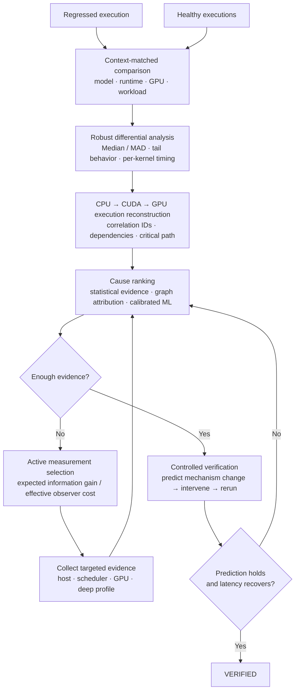

# Root

**GPU inference regression debugger.**

Root traces an inference regression across the CPU→CUDA→GPU path, ranks likely causes, collects the next useful profiler signal, and verifies the diagnosis with a controlled rerun.

Inference slowdowns are difficult because the visible bottleneck is often downstream of the real cause. Queue buildup, host submission stalls, synchronization, transfers, kernel slowdowns, memory layout, and contention can all overlap in the same trace.

## Architecture



Root matches a regressed execution to comparable healthy runs, computes robust per-stage and per-kernel timing deltas, and reconstructs dependencies across the CPU→CUDA→GPU path. It combines statistical, structural, and calibrated ML evidence to rank competing causes. If uncertainty remains, Root chooses the next measurement by expected information gain relative to its effective observer cost. A diagnosis is only verified after a controlled intervention produces the predicted mechanism change and end-to-end latency recovery.

The loop is:

**match the right healthy run → measure the difference → reconstruct the execution path → rank causes → collect only the next useful signal → test the strongest explanation.**

## What Root is doing

- **Context-matched comparison** — avoids comparing an incident against a healthy run from a different hardware/software environment.
- **Robust differential statistics** — uses distributional comparisons instead of relying on one latency sample or a single aggregate.
- **Per-kernel GPU comparison** — compares like-for-like kernels so heterogeneous kernel distributions do not hide a coherent slowdown.
- **CPU→CUDA→GPU reconstruction** — connects host work, runtime calls, transfers, streams, kernels, and synchronization before assigning blame.
- **Statistical + ML cause scoring** — combines multiple signals rather than treating the loudest anomaly as the answer.
- **Active profiling** — when several causes still fit, Root chooses the next measurement that best separates them instead of enabling every profiler at once.
- **Controlled verification** — a suspected cause is tested against a predicted mechanism change and end-to-end latency recovery.
- **Incident memory** — verified investigations can be reused as evidence for future incidents.

## Real GPU evaluation

Root has been evaluated on **SmolVLA inference running on an NVIDIA T4** using real PyTorch/CUDA traces. Full trace files are kept outside git because individual captures are hundreds of megabytes; [`workloads/smolvla/TRACES.md`](workloads/smolvla/TRACES.md) is the committed trace and provenance index.

The evaluation covers three useful behaviors:

- localizing large GPU timing regressions;
- separating correctness failures from latency regressions;
- staying quiet on clean runtime changes.

### Healthy baseline

Two 1,000-frame healthy SmolVLA runs produced **bit-identical outputs**, device-latency medians within roughly **1%** (4.14 ms vs 4.11 ms), and p95 within roughly **5%**.

### Large latency regression

| Metric | Healthy | Regressed | Change |
|---|---:|---:|---:|
| Median device latency | 3.94 ms | 9.94 ms | **+152%** |
| p95 device latency | 7.07 ms | 23.3 ms | **+230%** |
| Matched GPU anomaly | 0.39 control | 4.11 | strong trip |

The matched per-kernel GPU comparison isolated a strong GPU timing anomaly while the healthy control remained quiet.

### Correctness change without a latency regression

An FP16 SmolVLA run produced **0/250 identical output hashes** versus its FP32 control while median latency changed only **+2.9%**, inside the healthy timing band. The latency diagnosis stayed quiet rather than forcing the change into a latency cause.

### Replication

Two larger SmolVLA stress configurations reproduced substantial timing regressions on T4:

- **+207% median / +275% p95** — September 14 run.
- **+177% median / +241% p95** — September 16 run.

A separate `torch.compile` run stayed inside the healthy thresholds with identical outputs, providing a clean negative control.

## Evidence model

Every investigation is backed by an append-only typed evidence ledger:

```text
OBSERVED   telemetry directly measured from the execution
    ↓
INFERRED   diagnosis supported by current evidence
    ↓
TESTED     a targeted intervention was executed
    ↓
VERIFIED   predicted mechanism changed and latency recovered
```

Telemetry, statistical comparison, execution dependencies, profiler evidence, and controlled experiments are the source of truth.

## Research basis

The architecture came out of a three-week research/build cycle. I used a swarm of agents to screen **3,000+ papers** across runtime diagnosis, observability, GPU profiling, active debugging, uncertainty, and incident retrieval, then narrowed the useful mechanisms into the system above.

The final design draws from work on:

- active diagnosis and sequential measurement selection;
- statistical calibration and evidence fusion;
- CPU/GPU execution tracing and critical-path reasoning;
- GPU kernel, source, stall, and tensor-level diagnosis;
- incident retrieval and structural memory;
- controlled interventions for verification.

The repository includes the research corpus and project notes used to compare candidate mechanisms.

## Repository map

```text
reflex/                  current Python package
  collect.py             trace ingestion + adapters
  diagnose.py            matched differential diagnosis
  confidence.py          confidence / evidence scoring
  calibrate.py           ML calibration and cause ranking
  deep.py                deeper GPU analysis
  ledger.py              typed evidence ledger
  memory.py              incident retrieval

workloads/smolvla/       real SmolVLA workload + T4 trace inventory
colab/                   GPU workload / Colab entry points
scripts/                 collection, evaluation, and experiment runners
tests/                   regression and contract tests
reflex-project-notes.md  research and architecture notes
```

The repository and Python package still use the original internal name `reflex`; **Root** is the project name.

## CLI

The current package exposes:

```bash
python -m reflex show-me --ledger <ledger.jsonl> --incident <id> --summary <summary.json>
python -m reflex eval --out eval-out
python -m reflex demo --out demo-out
```

`show-me` renders one investigation from the evidence ledger. `eval` runs the hidden-fault evaluation harness. `demo` runs the end-to-end development demo.

For the real SmolVLA/T4 evidence, start with [`workloads/smolvla/TRACES.md`](workloads/smolvla/TRACES.md).

---

**Research question:** *How quickly and cheaply can Root move from “inference got slower” to a verified engineering explanation?*
