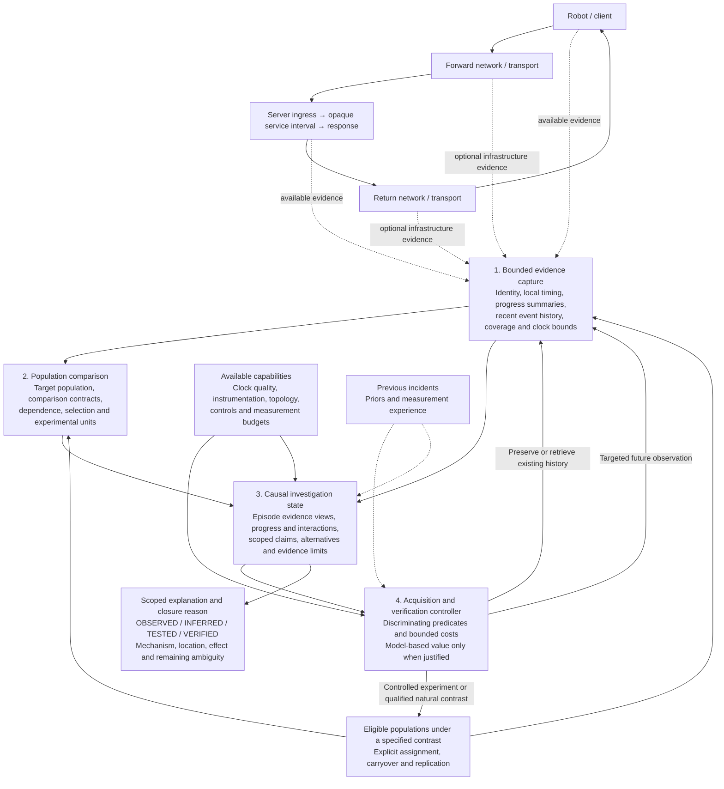

# Root: Sequential Causal Investigator

Root is a sequential causal investigator that connects population contrasts, partial histories of useful data progress, and scoped causal claims. Contrastive delivery episodes organize the evidence; they do not define statistical independence, experimental assignment, or the complete causal history.

Its central operation is to acquire evidence that can change a consequential diagnostic claim, subject to access, time, cost, and observer-perturbation limits. Detection, localization, transport analysis, and verification participate in that same loop. The default acquisition policy uses explicit discriminating predictions; expected-value optimization is available only when its predictive models are defensible. Neither policy assumes that the hypothesis library contains the true mechanism.

This architecture synthesizes all 250 records in `mechanisms.csv` and the complete `families.md`, incorporating the subsequent adversarial review. Paper-reported performance gains are not predictions of Root's performance.

**The architecture follows from six things a network debugger must establish.**

1. **What changed?** A slow request is an observation. A regression is a meaningful change in behavior under a defined comparison: more deadline misses, longer delivery stalls, a shifted latency distribution, or more persistent bursts of failures.
2. **What progress was required, and what prevented it?** Network latency becomes consequential when useful data cannot advance across a boundary that gates completion. That boundary could be application submission, socket acceptance, transmission, transport delivery, message assembly, or application consumption.
3. **Was the comparison fair?** Different payloads, offered traffic, connection states, routes, or robot operating conditions can produce different tails without any component malfunctioning.
4. **Which mechanisms could produce the observed history?** The same completion time can result from very different sequences. Queue growth, missing data, delayed feedback, receiver scheduling, and serialization can all create a delivery drought followed by a burst.
5. **What evidence would distinguish those mechanisms?** Diagnosis is limited by identifiability. If two explanations predict the same available observations, greater confidence or more repetitions of those observations cannot separate them.
6. **What counterfactual has actually been established?** To claim responsibility for a regression, Root needs evidence that changing the suspected mechanism changes the relevant delivery behavior and outcome under comparable conditions.

These requirements imply a system that reasons about **changes in populations through histories of blocked progress**, while acquiring evidence selectively.

---

**The core abstraction connects a population contrast to evidence and permissible claims.** A contrastive delivery episode is a bounded evidence view containing selected deliveries and the preceding or concurrent activity that may explain them. It can cover a sample of a persistent regime; its boundaries do not imply that the cause began or ended there.

An episode can span several requests and flows. It can include work outside the affected request: an earlier upload that filled a queue, another connection sharing a bottleneck, or a transport recovery state inherited from previous traffic.

Each episode carries five connected elements:

| Element | What it establishes |
|---|---|
| **Outcome and population** | Which deliveries were affected, their deadlines, completion or failure outcomes, and the population-level change being explained. |
| **Comparison contract** | Which healthy observations are comparable, which differences are being investigated, and which variables must remain uncontrolled because they may be causal. |
| **Partial progress history** | Where useful data advanced, stalled, accumulated, recovered, or became available to the application. |
| **Competing causal explanations** | Mechanism chains, their predicted observations, contradictions, and unresolved distinctions. |
| **Evidence limits** | Clock uncertainty, missing boundaries, sampling, identity ambiguity, capture loss, and observer effects. |

Requests identify consequences. Flows identify transport context. Paths identify possible shared exposure. Events provide evidence. Cohorts establish whether behavior changed. **The episode connects these views without replacing their different units.** An investigation may join overlapping episodes and noncontiguous comparison populations. A shared observation has one identity even when several episodes reference it.

A hypothesis is evaluated across an explicitly defined target population when the mechanism is stochastic. The investigation separately records the observation unit, shared exposure and inherited state, treatment-assignment unit, and unit of replication. One hundred requests inside one congestion-recovery interval are not automatically one hundred independent replications.

Episode selection cannot define the outcome population after an intervention. If episodes are selected because a deadline was missed, an effective treatment makes treated episodes disappear. Root therefore measures treatment effects over the eligible population fixed by the comparison contract, including successful deliveries. Episodes supply explanatory detail within that population.

Inherited state is explicit: an already-full queue, reduced congestion window, relay credit, or changed route can precede the retained history. An unknown initial state remains unknown. Expanding an episode cannot recover an onset that was never recorded.

The architecture has four major components:



The server service interval is an opaque boundary measurement here. This architecture neither requires nor designs its internal computation.

**The evidence component preserves the history that cannot be recreated later.** It distinguishes recording, retaining, exporting, and analyzing evidence; all four have costs.

Three forms of evidence serve different purposes:

| Evidence form | Continuously available information | Purpose |
|---|---|---|
| **Population accounting** | Delivery counts, deadline outcomes, compatible latency summaries, workload and connection context. | Detect and quantify changes without depending on selected traces. |
| **Bounded recent history** | Request and message identities, boundary events, compact progress and transport-state transitions, relevant queue or scheduling events where available. | Recover the causal neighborhood of an interesting episode. |
| **Targeted detail** | Selected packet and ACK histories, scheduler traces, queue residence, wireless access events, relay boundaries, or infrastructure telemetry. | Resolve a specific remaining ambiguity. |

The continuous contract is capability-dependent. Application-only deployments cannot promise transport histories. Every source advertises what it actually measures, at what resolution, and for which traffic.

The minimum application evidence includes intended release time when defined, actual submission, useful completion, outcome, payload characteristics, and stable delivery identity. Recording intended release as well as actual submission prevents client scheduling delay and reduced offered load from disappearing from the diagnosis; this is the useful distinction in **M-6943fef9ee**.

Where transport state is available, **M-23251a056c** supplies the strongest default recording principle: capture state at meaningful events instead of exporting every packet. Root combines that with selective detailed analysis from **M-75886858c3**.

The result is an ordered history such as:

> Data became ready → entered a socket queue → transmission progressed → delivery stopped while work remained pending → recovery began → useful delivery resumed → message assembly completed.

Each transition retains its local interval, affected identity or byte range, progress counters, state changes, and coverage. Supporting details can include queue growth, retransmitted ranges, recovery timers, window restrictions, or application-limited periods.

This preserves distinctions that aggregate loss and RTT obscure:

- A drought while no data was ready differs from a drought with a backlogged sender.
- Retransmissions that unblock required bytes differ from retransmissions unrelated to completion.
- Packets arriving in bursts differ from the application consuming already-arrived data in bursts.
- Queue growth before a stall differs from queue growth caused by a stalled downstream consumer.

“Drought” therefore always names a boundary and states whether useful work was pending. The AP delivery-drought mechanism **M-a8b585efbf** motivates this distinction, but AP access is optional and drought alone does not establish wireless contention.

**Compact histories are deliberately incomplete.** Root does not pretend that one fixed signature is sufficient for every unknown mechanism. It retains exact transitions where affordable, bounded-resolution summaries elsewhere, and explicit indications of omitted detail. Small unbiased samples of ordinary episodes preserve healthy temporal structure and expose failures in the trigger policy.

For hindsight, Root combines **M-ce31ced1f7** with **M-e0dd58b0bd**: retrieve the affected delivery and its relevant predecessors and neighbors. Local buffering and retrospective retrieval avoid eager ingestion of all detailed traces, as demonstrated by [Hindsight](https://arxiv.org/abs/2202.05769).

The retrieval scope follows identified dependencies: the same connection, shared queue, competing traffic, or relay interval. Hindsight requires recorded identities and retrieval links; it cannot discover an unrecorded shared queue or automatically identify its competing flows. “Previous ten requests” is not a universal causal horizon. Retrieval expands backward while the beginning of the observed buildup remains unexplained, subject to retention and identity limits.

A local stall can pin history before a population regression is confirmed. This matters because waiting for statistical certainty can erase the evidence.

**Hindsight cannot recover events that were never recorded.** If the required event predates the retained horizon, Root records that gap and acquires evidence during a subsequent comparable episode. The new episode is evidence about recurrence, not a reconstruction of the original incident.

---

**All timing remains attached to its clock domain.** Root’s progress history is partially ordered; it does not require a fabricated global timeline.

Every timestamp records its clock source and uncertainty. Every relationship states whether it comes from explicit identity and protocol semantics, a bounded clock transformation, or an inferred association.

Within one clock domain, Root can measure durations directly. Across domains, it uses one of three defensible relationships:

- Explicit message or sequence identity establishes ordering without establishing transit duration.
- A clock mapping with bounded offset and drift establishes an interval for cross-domain duration.
- Matched local durations can sometimes establish a composite residual without synchronizing clock offsets.

For example, in a strictly nested request–response exchange:

\[
R =
(c_{\mathrm{response}}-c_{\mathrm{request}})
-
g_s(s_{\mathrm{response}}-s_{\mathrm{request}})
\]

Here \(g_s\) converts server elapsed time into compatible duration units. Clock offsets cancel; clock-rate uncertainty still matters.

That residual covers the portions outside the measured server interval. It does **not** isolate forward delay, return delay, or pure wire transit. Endpoint buffering may remain inside it. The subtraction is invalid when the chosen boundaries overlap through streaming or pipelining.

Software and hardware timestamps from **M-8c8fbeb4b7** can refine endpoint and transit intervals, but only with the required packet identity and clock alignment. Even a host clock and its NIC clock require an established mapping. In that mechanism, software stamps occur at driver boundaries; they do not establish application submission or complete-message readability. Every interval uses the actual timestamp semantics.

Root never obtains one-way timing by dividing RTT by two. Nor does it subtract independently computed percentiles to obtain a segment percentile. It compares joined intervals or explicitly modeled distributions.

For multiplexed and encrypted transports, application-to-transport relationships can be many-to-many. Request identity, stream offsets, message sequences, and packet identity remain distinct. Retransmissions and NIC offloads further complicate those relationships. A relay that terminates and recreates transport creates another boundary; absent explicit correspondence, the join remains uncertain.

---

**The population component separates preservation triggers from regression conclusions.** A striking event justifies preserving evidence immediately. It does not automatically justify declaring a changed distribution.

The principal population outcomes are:

- Deadline-exceedance probability.
- The latency distribution over supported ranges.
- Delivery-drought duration and consecutive missed or late deliveries.
- Completion, timeout, cancellation, and failure rates.

This catches regressions that leave p99 nearly unchanged but make misses more clustered, which can matter substantially to a control loop.

Root uses a sequential comparison between a stable reference population and recent compatible observations. **M-d967243475** motivates sequential two-window detection, but its reported results do not supply a universal detector for every network process.

The architectural choice is to test **predefined, operationally meaningful changes**, with uncertainty that accounts for temporal dependence:

- Deadline exceedances have exact counts and denominators.
- Latencies use a mergeable logarithmic-bucket summary from **M-f38b84cef0**. Relative-value accuracy is useful for skewed durations; [DDSketch](https://arxiv.org/abs/1908.10693) provides that mechanism.
- Ordered episode summaries retain burst structure that a quantile sketch discards.
- Statistical comparisons declare their dependence model and sampling scheme. Block comparisons are usable where available history supports the chosen blocks; repeated-look and multiple-cohort control must apply to the actual selection procedure.
- A declaration requires both statistical evidence and a material effect size.

Block-based calibration is conditional on the dependence and stability assumptions holding. When dependence extends beyond the available history, Root reports insufficient statistical resolution rather than treating every packet or request as an independent sample.

Exploratory evidence may select a cohort, mechanism, or discriminating test, but it does not also provide unadjusted confirmation of that selection. Confirmatory claims use subsequent eligible observations under a fixed contrast, or an inference procedure valid for the adaptive selection actually performed. Repeated-look correction for a fixed detector does not cover arbitrary post-hoc cohort discovery. A new cohort discovered during confirmation is exploratory until its own claim is supported.

The reference does not silently adapt to an unresolved regression. Confirmed regime changes create new reference contexts; they do not erase the incident.

Timeouts never vanish from the denominator. Unfinished deliveries contribute known deadline outcomes and censored duration information where appropriate. Cancellations retain their own semantics. A system that only summarizes successful responses can appear healthier while becoming less reliable.

**Healthy comparison is a causal decision, not a similarity-search problem.** Root compares populations satisfying an explicit contract, using the population-projection idea in **M-bf3ad10260**.

The contract identifies:

- The outcome being explained.
- The suspected exposure or change.
- Variables that must be comparable.
- Variables that may mediate the effect.
- Where healthy and affected populations have adequate overlap.

Payload size, application semantics, intended traffic, connection age, and endpoint roles often matter. But no variable is universally a matching key.

If routing changed and routing is a candidate cause, matching only within the new route would remove the effect under investigation. If congestion causes more in-flight requests, matching on observed concurrency can conceal congestion. Similarly, matching on retransmissions would condition on a potential consequence of the fault.

Root therefore separates two questions:

> Did the delivered workload or operating population change?

> Did behavior change for comparable workload and operating conditions?

It can answer both, but it does not conflate them. A deployment’s total effect may include larger messages or different pacing.

The healthy reference includes the normal tail; Root does not construct “healthy” by selecting only fast requests. Contemporaneous controls are useful where they have comparable exposure, but shared bottlenecks can contaminate them. Historical controls can be useful where current peers share the fault, but drift weakens them.

If comparable support is absent, the result is **an observed difference with an unresolved comparison**, not a precisely quantified regression caused by the network.

Causal roles can themselves be uncertain. Sender rate, for example, can be an external exposure, a mediator of congestion feedback, or a response to application delay. Root retains alternative comparison contracts when those roles are unresolved and reports which conclusions depend on each. It does not force an uncertain variable into one matching role to obtain a clean estimate.

---

**Localization identifies distinguishable intervals, dependencies, and interactions in the available progress history.** An earliest region is useful when one exists; it is not required for a regression to be real or explainable.

Root compares boundary-local durations, progress patterns, and waiting relationships across the affected and reference populations. It asks:

> At which observed boundary or dependency does behavior first become distinguishable, and what unobserved region remains between that evidence and the preceding comparable behavior?

The answer can be a set of regions. Concurrent causes and feedback do not necessarily produce one clean frontier.

A tail regression can arise entirely from changed dependence. Suppose two sequential durations have equal-frequency healthy pairs `(1, 11)` and `(11, 1)` milliseconds, then change to `(1, 1)` and `(11, 11)`. Each duration retains exactly the same marginal distribution, while total latency changes from always 12 ms to 2 or 22 ms. There is no first marginal timing anomaly. Root retains joined observations where available and tests relevant ordering, alignment, and shared exposure. Separate latency sketches cannot recover this relationship.

The relational change is initially an observation, not proof of the mechanism that created it. A phase shift or shared resource can be investigated as its cause. When joins were not retained, Root reports the missing relation instead of treating normal component marginals as evidence against a network explanation.

Three constraints prevent premature localization:

1. **The delay must affect required progress.** An abnormal interval that does not gate delivery cannot explain that delivery’s completion delay by itself.
2. **Upstream normality needs adequate evidence.** Failing to detect an upstream anomaly is not proof that the upstream behavior was equivalent.
3. **The first visible effect need not be the initiating cause.** A sender pause can result from delayed reverse-path feedback; a socket queue can grow because a downstream resource stopped serving it.

Root uses waiting relationships from **M-bee7eb4678**, boundary comparisons from **M-53e8680366**, and selective host evidence such as **M-38cb3b6028**. It materializes only the relationships needed for the current contrast. A permanently reconstructed graph of every packet and request is unnecessary.

The distinction between **where delay is incurred** and **what initiated it** remains explicit. For example:

> Required stream bytes were withheld during transport recovery.

can be strongly supported while:

> Wireless interference caused the initiating loss.

remains unresolved.

---

**The investigation component represents hypotheses as causal relationships with observable consequences.** A simple mechanism can be a chain; feedback, masking, and shared exposure require a partial dependency structure. Root does not maintain one mutually exclusive label per research family.

A candidate explanation specifies:

- An initiating condition or change.
- A mechanism affecting service or progress.
- The resulting blocking dependency.
- The affected population and expected outcome change.
- Necessary observations, discriminating predictions, and possible falsifiers.
- Its assumptions and the evidence currently missing.

For example:

> A changed sender batching pattern creates bursts exceeding a service rate; a shared queue accumulates; required request bytes wait; deadline-exceedance probability increases.

That is more useful than separate labels for “burstiness,” “bandwidth,” and “queueing.” The observations can support parts of the chain without supporting the whole chain.

Candidate compositions are considered when evidence indicates shared state or interactions, and when a single mechanism leaves important evidence unexplained. A good single-mechanism fit does not exclude a masked second cause. Root can represent loss plus recovery amplification, or endpoint scheduling plus socket buildup, without assuming all incidents have one cause. An explicit unknown mechanism remains available.

Evidence updates obey different rules:

- A contradiction of a well-observed invariant can eliminate a hypothesis.
- A noisy observation changes support; it rarely eliminates a stochastic explanation outright.
- Absence of an event is useful only when the event would have been detectable.
- Several features derived from the same episode do not constitute several independent witnesses.
- A hypothesis that fits recorded features poorly must not survive simply because the candidate list contains nothing better.

For instance, loss count, retransmission count, recovery duration, and a delivery drought may all describe one underlying recovery episode. Multiplying their apparent likelihoods as independent evidence would manufacture confidence.

The ledger therefore records evidence dependencies as well as evidence values. Provenance prevents duplicate counting, but does not supply a joint likelihood model: distinct measurements may still depend on the same hidden queue or operating regime. Numeric probabilities are used only where joint or conditional outcome models justify them. Elsewhere, Root preserves compatible explanations and explicit contradictions; likelihood ranges are used only when their bounds have a defensible source.

**An unknown-mechanism entry does not close the hypothesis space.** It has no universal likelihood and cannot be eliminated because known candidates fit well. A novel relay release policy may reproduce every retained queueing signature and respond to the same rate reduction. Root can establish delayed release or the intervention's effect while leaving the internal mechanism unresolved. Model fit and residual checks can reveal some omissions; their success does not establish completeness.

An inferred explanation means strongest among the considered explanations at the supported scope. A verified claim must be justified by its direct evidence and contrast, rather than by exhausting a finite library. Historical incidents can guide candidate generation and acquisition, but their conclusions are not evidence about this incident.

Each explanation has separate confidence in **mechanism**, **location**, and **effect on the regression**. A single confidence score would hide important differences.

---

**The controller selects evidence by the distinctions it can resolve.** This is the architectural center.

Root identifies consequential claim distinctions: required data not yet available versus available but not consumed, recovery blocking completion versus incidental retransmission, or a directional effect versus an unresolved round trip. Different hypotheses can support the same claim, and claim scopes can overlap. Sharing a possible mitigation is insufficient: two different causes can respond to the same broad intervention.

This adapts the decision-region objective of **M-03b21b0f48**: gather information to resolve a decision, rather than reducing uncertainty indiscriminately. [Hyperedge Cutting](https://arxiv.org/abs/1402.5886) supplies that principle. Its known hypothesis prior, deterministic test outcomes, and fixed decision regions are not supplied by the mechanism corpus. Root does not use that algorithm's guarantees as a guarantee for open-world diagnosis.

A candidate acquisition specifies its scope, prerequisites, outcome predicates, coverage requirements, and which claims each interpretable outcome supports or contradicts. It includes an inconclusive outcome for missing, noisy, or confounded evidence. Predictions identify their basis: protocol or boundary semantics, a current-incident empirical model, a transferred model, or an unvalidated conjecture. Unknown noise and cost remain unknown or bounded where justified.

One measurement can separate many explanations. Suppose the application sees a receive drought. A targeted record linking NIC arrival, transport readiness, and application consumption can distinguish:

| Result | Diagnostic implication |
|---|---|
| Required data arrived and became readable promptly; consumption was delayed | Focus on endpoint dispatch or consumption. |
| Packets arrived, but required data remained unavailable pending repair or reassembly | Focus on transport delivery semantics. |
| Relevant packets did not arrive during the interval | Move the unresolved region upstream of that boundary. |
| Capture coverage is incomplete | Preserve the ambiguity; do not interpret missing events as missing packets. |

That single acquisition can outperform independent tests for loss, bandwidth limitation, socket buffering, and application scheduling.

**The default policy operates without calibrated outcome probabilities.** It follows a partial ordering rather than assigning invented information-gain scores:

1. Preserve expiring evidence within the recording budget. Preservation is an option to inspect evidence later, not a causal test.
2. Select an unresolved claim distinction whose resolution would improve the explanation at the requested scope. An always-valid statement such as “latency increased” does not by itself satisfy that diagnostic objective.
3. Admit acquisitions with feasible prerequisites and at least one justified, decision-relevant outcome predicate. Reject a proposed discriminator if every interpretable outcome leaves that distinction unchanged. Treat overlapping stochastic outcomes as overlapping compatibility sets, not a deterministic partition.
4. Prefer direct boundary evidence and valid contrasts over conjectured signatures. Remove an action as dominated only when another covers its useful distinctions with no worse supported cost and coverage bounds; uncertain comparisons remain ties.
5. Among remaining actions, use the investigation's explicit priority for claim scope, then defensible bounds on elapsed time, resource cost, and perturbation. When these do not determine a winner, choose a bounded acquisition under a declared tie-break preference and record the unresolved tradeoff. Do not claim that the choice is optimal.

This policy can choose a readiness-to-consumption measurement because its outcomes distinguish a concrete boundary, without knowing the prevalence of scheduling faults. It cannot promise how often the measurement will succeed, or rank all stochastic interventions optimally. Counting hypotheses eliminated is not a substitute: splitting one queueing hypothesis into one hundred variants must not make that acquisition more valuable.

**Model-based expected value is a conditional refinement of the same policy.** It requires conditional outcome probabilities given current evidence, dependence between proposed measurements, regime and recurrence assumptions, an explicit loss for incorrect or insufficiently precise claims, and cost and perturbation estimates. Protocol invariants provide some predictions, not their population frequencies. Historical results require a justified transfer to the current regime; repeated observations do not identify an untried intervention's outcome distribution by themselves.

When those inputs are supported, the controller may rank bundles by expected reduction in the stated diagnostic loss against time, cost, and perturbation, subject to hard limits. It records model provenance and sensitivity to uncertain inputs. If rankings change across defensible models, the ranking is unresolved and the default policy applies. A model mismatch returns the investigation to qualitative constraints; it does not become evidence against an unmodeled mechanism.

**M-8e63d7ad26** motivates accounting for test dependence. Its [ECED formulation](https://arxiv.org/abs/1605.07334) assumes known conditional test distributions and conditional independence given a modeled latent state. It is not a general solution for unknown correlations, incomplete hypotheses, or persistent network state. Repeated readings of one recovery episode cannot be treated as independent noise reduction.

Costs include activation, collection, retention, export, analysis, waiting for sufficient replication, and possible loss of operating capacity. They are incremental and can depend on the outcome, taking the useful idea from **M-9bdb7735d9** without importing its known discrete test partitions or deterministic diagnostic guarantees. Waiting time requires a recurrence assumption; if recurrence is unknown, a capture has an explicit time budget and may end inconclusively.

The controller evaluates bundles because:

- Two endpoint captures may be useful only together.
- One instrumentation setup may answer several questions or serve several incidents.
- Clock calibration may enable several otherwise uninterpretable measurements.
- A cheap prerequisite may unlock a highly discriminating observation.
- An expensive capture can be cheaper than several inconclusive experiments.

Shared costs are charged once, including capture or calibration serving overlapping investigations. Shared observations also retain one identity. Repeated measurements are valuable only to the extent that they add independent or otherwise useful evidence.

Observer perturbation is a validity condition as well as a cost. Low average overhead does not bound rare scheduling or queue disturbances. Where its tail effect cannot be bounded, Root limits the acquisition and checks whether the measured regime changed; a perturbed trace may describe instrumented behavior rather than the original incident. An experiment that changes ACK handling, traffic volume, or shared resource allocation must account for those pathways before receiving a narrow causal interpretation.

The loop has no mandatory sequence of “localize fully, then identify mechanism, then experiment.” It can choose an intervention before deep tracing when the intervention is more discriminating and less costly.

Cheap existing evidence usually wins. Two exceptions matter: volatile evidence may need immediate preservation, and a more expensive measurement may eliminate much more uncertainty.

A compact description of the loop is:

```text
Preserve threatened episode history.

Establish target population, comparison contracts, evidence limits,
inherited state, and assignment and replication units.

Repeat:
    Reconstruct relevant progress, ordering, and shared-dependency relationships.
    Update candidate mechanisms, contradictions, and indistinguishable groups.
    Preserve unknown initial state and the possibility of unmodeled mechanisms.
    Determine the strongest currently defensible scoped claim.

    Generate feasible observations, interventions, and prerequisite bundles.
    Check prerequisites, claim-changing predicates, coverage, and bounded costs.
    Rank by the qualitative policy; use expected value only with justified models.

    If the scoped objective is supported, or an explicit stopping limit is reached:
        return claims, alternatives, assumptions, and the actual closure reason.

    Acquire the selected evidence.
    Check identity, coverage, clock validity, and intervention delivery.
    Update the evidence ledger without duplicating shared observations.
    Keep adaptive discoveries exploratory until valid confirmation is available.
    Apply verification requirements to any causal claim.
```

Stopping evidence acquisition does not promote an inferred explanation to verified.

Closure records both the epistemic result and the operational reason. The result can be a verified scoped contribution, unresolved candidates, or evidence suggesting an unmodeled mechanism. The reason can be sufficient evidence for the requested scope, exhausted available capabilities, expired history, a changed regime, or a time, cost, or perturbation limit. “No useful next action among the feasible actions considered” is not proof that no possible measurement could help. A useful terminal answer states what changed, the supported boundaries, surviving alternatives, and the missing distinction even when no specific cause is identified.

---

**Verification belongs inside the same investigation, but has a separate evidentiary gate.** The four states apply to individual claims, rather than becoming one badge for an entire incident.

| State | Meaning |
|---|---|
| **OBSERVED** | A measurement or event was recorded, with its scope and measurement limits. |
| **INFERRED** | A mechanism explains the current evidence and survives the available competing explanations. |
| **TESTED** | A discriminating contrast was executed and the intended manipulation or exposure change was established. Its result can support, contradict, or leave the claim unresolved. |
| **VERIFIED** | The test supports the predicted mechanism and a material effect on the specified outcome, with sufficient replication and control of credible alternatives for the stated scope. |

A verified claim is always conditional on a population, operating regime, and set of assumptions. It is not a universal statement about the network.

Verification separates three possible claims: an intervention changed the outcome; a specified mechanism contributed under the tested conditions; that mechanism caused the historical regression. The first does not establish the second, and a later recurrence test does not automatically establish the third. Even a mediator and outcome changing together can reflect several pathways altered by the intervention. Mechanism verification requires evidence that distinguishes the claimed pathway from those alternatives at the stated scope.

Before a test, Root records:

- What mechanism is being changed.
- What intermediate behavior should change.
- What outcome should change, and by how much would be diagnostically meaningful.
- Which rival explanations predict different results.
- Which variables must remain comparable.
- What would make the test inconclusive.

Afterward, it checks both the manipulation and its consequences.

This requires more than a faster rerun. If a pacing intervention is intended to reduce queue accumulation, Root should establish that the intended pacing changed, that the relevant queue or blocking signature changed, and that the affected delivery population improved. A latency improvement with no corresponding mechanism evidence supports a broader intervention-effect claim.

Broad substitutions receive correspondingly broad conclusions. Replacing Wi-Fi with Ethernet, TCP with another transport, or one server with another changes several mechanisms. Such experiments can narrow a region or establish sensitivity, but cannot automatically verify one specific queue or recovery cause.

For stochastic effects, the experimental unit must respect shared state. Requests sharing a queue are often poor independent treatment units. Root uses repeated comparable time blocks, connections, or resource groups as appropriate, with randomized or interleaved assignment where feasible. Queue drainage, connection state, congestion-control memory, and carryover determine washout requirements.

**M-b07ffcf3c2** contributes the need to model what persists across an intervention. Otherwise, a disappearing transient fault or a lingering queue can be mistaken for the treatment effect.

Natural interventions can also support causal claims when exposure changes are demonstrably external to the outcome process, comparison groups remain valid, and competing simultaneous changes are addressed. A coincident route change and latency recovery does not meet that standard by itself.

From **M-8d521dcb7e**, Root retains prediction-independent verification: the investigator’s preferred diagnosis cannot provide its own truth label. It rejects a literal “two witnesses” rule for stochastic network causality. Two observations may be far from sufficient, and two correlated counters may represent only one witness.

A mechanism can be verified as a **contributor** without explaining the entire regression. Root reports measured recovery and residual degradation separately. It does not add independently estimated p99 contributions or assume that interacting effects sum.

Lack of end-to-end improvement does not eliminate a mechanism when another cause masks its effect. If completion waits for two streams delayed to 80 and 100 ms, removing the 80 ms delay leaves completion at 100 ms. Root checks the predicted intermediate change and the remaining dependency. The test may establish a local mechanism effect while leaving its contribution to the chosen outcome unverified. Joint or conditional contrasts are necessary when the causal claim concerns an interaction.

---

**Observability changes the precision of the same model.** It does not select a different architecture.

| Available evidence | Defensible resolution | Remaining limitations |
|---|---|---|
| **One application endpoint** | Recorded local application intervals, response outcomes, delivery patterns, effects of controlled endpoint changes. | Network arrival versus delayed consumption requires an additional readiness boundary. Remote service, both directions, and intermediate waits may remain combined; Root may be unable to attribute the regression to networking at all. |
| **Endpoint transport state** | Recovery episodes, sender or receiver restrictions, delivery progress, socket-related evidence where exposed. | Physical loss location and hidden queues remain unresolved. Transport-specific semantics matter. |
| **Both endpoints, unsynchronized clocks** | Explicit delivery joins, local processing intervals, ordering, and valid composite residuals. | General one-way transit durations remain unavailable. |
| **Kernel and NIC boundaries** | Finer separation of endpoint scheduling, stack handling, queues, and packet arrival or departure. | Uninstrumented path segments remain opaque; clock mappings and offload semantics still matter. |
| **Bounded synchronization** | Directional intervals with uncertainty bounds. | Timing alone does not identify the mechanism inside an interval. |
| **AP, relay, or infrastructure evidence** | Queue residence, channel-access behavior, relay handling, or path-specific effects at observed locations. | Visibility can be incomplete or biased toward successfully delivered telemetry. |
| **Known topology and sufficient path measurements** | Conditional inference about hidden shared links or resources. | Identifiability, routing stability, additive models, and endpoint contributions must be established. |

For wireless evidence, **M-a2c42995f9** preserves a necessary distinction between waiting before link assignment and waiting for channel access. Those are different mechanisms even when both appear as “Wi-Fi delay.”

For programmable infrastructure, **M-025a48fc5e** measures switch ingress-to-egress residence, which includes more than queueing. It is not a direct queue-residence measurement. **M-e5f0c9ba7d** provides subqueue sojourn traces in its instrumented simulation setting; equivalent production evidence exists only when corresponding queue boundaries are exposed. Sampled or aggregate telemetry is useful when its freshness and relationship to the affected traffic are known.

Topology-based inference is admitted as a conditional measurement action. Before invoking it, Root checks whether available path equations distinguish the candidate locations. If several links have indistinguishable exposure, the output names that set. A sparse recovery algorithm must not choose one location merely because its optimization prefers it.

Missing telemetry is also an observation about the measurement system. Congestion may suppress telemetry precisely when it matters. Root distinguishes “no event,” “no report,” and “no coverage.”

**Identifiability is checked for each claim and capability set.** Structural distinguishability and finite-sample support are separate: a measurement may distinguish mechanisms in principle while the current sample is too small or noisy to do so.

| Competing explanations | Evidence that remains insufficient | Additional distinction required |
|---|---|---|
| Forward-path queueing versus reverse-path impairment | Sender RTT and retransmissions alone | Directional interval bounds or suitable feedback-generation and arrival evidence; even a directional delay does not identify queueing by itself. |
| Delayed transmission versus intermediate buffering | Receiver delivery gaps | Required-data readiness and actual sender egress, joined to receiver evidence; a send call is not wire departure. |
| Wireless contention versus generic loss/recovery | Endpoint loss and recovery signatures | Relevant MAC eligibility, access, retry, and queue evidence or a sufficiently specific controlled contrast. |
| Sender scheduling versus network delay | Receiver timestamps and request completion | Sender readiness, execution, and transmission boundaries. |
| Route change versus congestion on an unchanged route | A changed RTT distribution and a current traceroute | Historical evidence of the affected traffic's route, or a valid route intervention; current probes may follow another path. |
| Queueing versus relay release policy or shaping | Droughts, bursts, and improvement after reducing traffic | Direct service-policy evidence or a contrast with different predictions. |
| Independent causes versus changed interaction | Normal marginal latency summaries | Joined progress, shared exposure, ordering, and appropriate conditional contrasts. |

Unsynchronized endpoints can still compare local spacings and explicit sequence order; they cannot manufacture one-way delay. For example, **M-19393aed54** motivates comparing ACK emission and arrival spacing at both ends to investigate reverse-path distortion. Sender-only ACK spacing cannot distinguish delayed feedback emission from delay on its return path, and spacing distortion alone does not prove a particular competing flow caused it.

---

**A worked episode illustrates the complete architecture without synchronized clocks.**

Suppose response deadline misses increase, and client-visible deliveries arrive in bursts. The initial explanations include return-path queueing, loss recovery, relay buffering, and delayed client receive processing.

The population component confirms that the change persists for comparable payloads and intended request rates. It preserves representative affected episodes and ordinary reference episodes, including preceding traffic.

The retained transport history contains occasional retransmissions, but their association with the missed requests is weak. Root keeps loss recovery plausible; it does not declare it causal.

The controller selects a bounded client capture connecting transport data readiness to application consumption. This one acquisition can distinguish several explanations.

During repeated affected episodes, the required response data becomes available in the client transport promptly, but the application consumes it late. Scheduler evidence shows the receiving thread runnable during much of that interval.

The first distinguishable region is now the client’s receive-processing interval. These observations strongly weaken path-delay explanations for those particular late completions. They do not prove that the network is healthy for every request.

Root proposes:

> Scheduling interference delays consumption of already-available responses and materially increases deadline misses in this cohort.

It selects a controlled contrast that removes the identified scheduling interference while preserving workload, traffic, and network configuration. The prediction is specific: runnable waiting and data-ready-to-consumption delay should fall, while packet-arrival behavior should remain comparable.

Repeated controlled blocks produce that pattern and reduce deadline misses materially. Root can verify the scheduling mechanism as a contributor within the tested regime.

If retransmissions persist after the intervention, they remain observed network behavior. They no longer receive blame for the portion of the regression that recovered.

If the intervention instead changes packet arrivals as well, the causal claim remains broader until Root separates the effects.

---

**Several attractive research mechanisms are deliberately excluded from the foundation.**

| Alternative | Architectural decision |
|---|---|
| **Permanent packet-level tracing** | Its cost is paid before knowing which distinctions matter. Bounded progress history plus targeted packet evidence preserves a better acquisition tradeoff. Some original episodes will remain unresolved, and Root says so. |
| **Percentile sketches as the diagnostic representation** | They support detection and comparison but lose identity, ordering, and blocking relationships. Root selects one primary duration-summary mechanism rather than maintaining several interchangeable sketch subsystems. |
| **A complete universal request or packet graph** | Rich graphs require missing identities and expensive events. Root constructs partial, relevant dependency views and exposes gaps. |
| **Earliest anomaly, lagged correlation, or learned fault classification as final attribution** | Mechanisms such as **M-ce1049fbc7**, **M-395d5949fa**, and **M-c40d8389f5** can nominate explanations. Confounding, timing resolution, and unseen mechanisms prevent them from establishing causality. |
| **Universal sparse tomography or coded group testing** | **M-f3e152272e**, **M-3a91180fc3**, and **M-dc5a4a35bb** rely on restrictive topology, sparsity, additive-delay, or Boolean-outcome assumptions. They are conditional actions, not the diagnostic foundation. |
| **Pure entropy maximization or independent cause-by-cause testing** | These can spend heavily on irrelevant distinctions and duplicate correlated evidence. Root values distinctions between defensible claims and evaluates shared acquisition bundles. |
| **General learned causal graphs with continuous experiment optimization** | **M-f708267618** and **M-a44edb35ed** require credible predictive models and substantial assumptions. Explicit mechanism predictions and bounded intervention choices provide a more defensible default. |
| **ANN retrieval, graph embeddings, and elaborate incident-memory systems** | These accelerate finding candidates; they do not establish comparability. Explicit context constraints suffice as the architectural requirement. Prior incidents influence priors and acquisition choices only. |
| **Congestion control, replication, compression, and routing policies as diagnosis components** | These change service behavior and may mask a cause. They enter only as carefully interpreted interventions when useful for discrimination. Root is not a transport controller. |
| **Extreme-value prediction as the default evidence of a regression** | Tail extrapolation adds model assumptions without identifying a mechanism. Empirical supported outcomes take precedence; modeled rare-event estimates remain labeled estimates. |

**Research mechanisms contribute primitives under explicit transfer limits.** Their composition does not supply assumptions missing from either mechanism.

| Mechanism | What Root retains and what it does not inherit |
|---|---|
| **M-6943fef9ee**: intended versus actual dispatch | Distinguish release intent from submission. A feedback-driven robot's intended rate is not automatically an exogenous workload control. |
| **M-23251a056c**, **M-75886858c3**: transport profiles and selective TCP analysis | Event-based state and targeted transport evidence. Sparse profiles omit between-event history; TCP state inference does not transfer unchanged to QUIC or every congestion-control algorithm. |
| **M-ce31ced1f7**, **M-e0dd58b0bd**: hindsight and predecessor retrieval | Retrieve recorded, linked context. These are complementary aspects of the same retrieval approach, not independent causal witnesses. Sparse recording plus hindsight cannot recreate packet history. |
| **M-d967243475**: sequential two-window detection | Sequential comparison under the applicable distribution and dependence assumptions. Its guarantees do not cover arbitrary adaptive cohorts and stopping rules. |
| **M-f38b84cef0**, **M-bf3ad10260**: quantile sketches and population projections | Compression and retained-attribute comparison. Quantile approximation error is not statistical confidence; mergeability does not recover discarded joins or arbitrary later conditioning. |
| **M-bee7eb4678**, **M-53e8680366**: waiting relationships and stage/queue evidence | Relevant boundary and dependency observations. Host waiting graphs do not establish missing packet dependencies; stage attribution depends on instrumented coverage. |
| **M-38cb3b6028**: kernel ingress histograms | Boundary-specific stack delay evidence. Default head-of-line exclusions can remove cases relevant to this investigation; a filtered population cannot establish absence of delay for excluded requests. |
| **M-a8b585efbf**, **M-a2c42995f9**: AP drought and queue/access decomposition | Pending-work droughts and distinct queue/access intervals. Coarse AP reports do not resolve shorter stalls; successful delivery counters alone do not establish a station was eligible to transmit. |
| **M-8c8fbeb4b7**, **M-025a48fc5e**, **M-e5f0c9ba7d**: timestamp and residence boundaries | Exactly the intervals exposed by the instrumentation, with identity and clock requirements. Driver time, switch residence, and queue sojourn remain different quantities. |
| **M-03b21b0f48**, **M-8e63d7ad26**, **M-9bdb7735d9**: decision regions, noisy tests, outcome-dependent costs | Claim-directed acquisition, dependence awareness, and incremental costs. The papers do not supply Root's hypothesis prior, outcome model, latent state, or diagnostic loss. |
| **M-b07ffcf3c2**: persistence across interventions | Explicit carryover and initial state. The paper's specified causal models and restricted fault assumptions are not a general network causal-identification procedure. |
| **M-8d521dcb7e**: independent verification witnesses | A proposed diagnosis cannot supply its own truth label. A fixed workload-coverage rule or two witnesses does not establish stochastic network causality. |

**The incident traces constrain the final architecture.** They are architectural counterexamples and expected diagnostic limits, not an implementation or evaluation roadmap.

| Incident | Evidence flow, useful acquisition, and legitimate stopping claim |
|---|---|
| **Burst loss and recovery** | Deadline misses plus retransmissions select a recovery evidence view; comparison includes eligible deliveries in comparable connection states. Byte/stream readiness and recovery progression can establish that repair gated completion. Missing receiver evidence leaves physical loss, reordering, or delayed originals unresolved. Retransmission alone never verifies initiating loss. |
| **Persistent queueing / bufferbloat** | Sustained delay selects windows within a regime whose initial backlog may be unknown. Comparable offered traffic and direct queue boundaries are preferable to an idle historical baseline. Rate reduction can establish load sensitivity while also changing wireless access or shaping; absent direct discrimination, the output remains broader than bufferbloat. |
| **Wireless contention** | Delivery droughts require pending, eligible work. AP queue/access/retry evidence may distinguish candidates if its resolution covers the stall. Missing or coarse MAC evidence leaves contention, retries, power saving, and upstream starvation unresolved; active probes may change contention. |
| **Endpoint CPU scheduling** | Bursty callbacks are compared over eligible deliveries. Complete required-data readiness followed by runnable waiting separates consumption delay from late arrival. A scheduling intervention must preserve relevant packet and ACK behavior to verify that specific pathway. This direct boundary test needs no calibrated fault prior. |
| **Route/path change** | A timing regime change can outlast every episode. The contrast preserves route change as a candidate exposure. Historical packet-relevant route evidence can help; a present traceroute cannot recover the old route. Without that evidence, Root stops at the changed regime and unresolved path/congestion alternatives. |
| **Bandwidth limitation / serialization** | Size-related delay retains actual readiness, egress, window, pacing, and payload context. A size change can also change encoding and service time. A serialization claim needs a defined link and service interval; end-to-end goodput is not proof of physical link capacity. |
| **Reverse-path impairment** | Forward stalls require a history including prior feedback. Matched ACK emission/arrival spacing or directional bounds can narrow the feedback path. Sender-only evidence cannot separate remote ACK generation from return transit; Root can report feedback-limited progress without blaming the forward path. |
| **Multiple simultaneous causes** | Joined progress exposes masking or changed dependence. A single intervention with no completion improvement does not eliminate a delay hidden behind another gating stream. Local mediator effects and conditional or joint contrasts determine the supported scope; separate marginal sketches can miss the regression entirely. |
| **Novel relay mechanism** | A new credit-release policy can imitate queueing and improve after pacing changes. Every known signature can fit. Root records the observed release behavior and tested intervention effect without claiming the queueing label is verified; a successful residual check cannot certify library completeness. |
| **One application endpoint** | Local round-trip outcomes establish a changed delivery population. Repeated timing cannot separate forward transit, opaque service, return transit, and unobserved endpoint handling. If no additional boundary or valid intervention is available, Root terminates with that composite region rather than asserting a network cause. |

**The adversarial review preserves the four components and removes unsupported closure assumptions.**

A separate fixed localization stage is unnecessary: a measurement may establish location and mechanism together. A separate transport classifier is unnecessary: its state analysis supplies constraints to the same hypotheses. A separate “deep diagnosis” system is unnecessary: richer evidence enters the same episode and verification model.

The required corrections address the most dangerous confident errors:

- **Episodes cannot supply independence or causal closure.** Populations, inherited state, treatment units, and replication units remain explicit.
- **Acquisition cannot depend on unavailable probabilities.** Qualitative predicates and bounded costs provide the default; expected-value models require evidence and declared preferences.
- **The library cannot certify its own completeness.** Claims and stopping reasons remain scoped even when one candidate fits all recorded evidence.
- **Normal marginals cannot rule out changed interactions.** Localization includes dependencies and joint behavior.
- **Exploration cannot silently become confirmation.** Adaptive selection must be accounted for in the inferential claim.
- **Comparison cannot erase the candidate cause.** Uncertain causal roles retain alternative comparison contracts.
- **Compression cannot masquerade as completeness.** Every conclusion respects retained resolution, identity coverage, and missing history.
- **Successful mitigation cannot overstate causal specificity.** Verification is restricted to the mechanism and population actually distinguished by the experiment.

Two explanations can remain fundamentally indistinguishable. With only endpoint RTT, forward-path queueing and reverse-path queueing may be inseparable. With receiver delivery gaps but no sender or infrastructure evidence, burst loss, delayed transmission, and intermediate buffering may remain equivalent. More RTT samples can quantify the phenomenon while leaving its mechanism unresolved.

In those cases, Root returns the strongest supported statement, the surviving alternatives, and the exact missing distinction. **An unresolved causal boundary is a valid architectural output; an invented explanation is not.**
