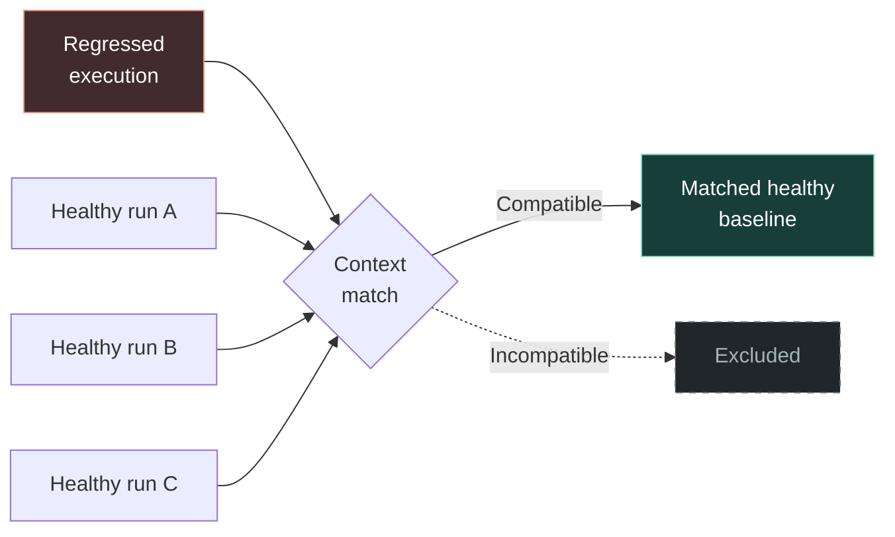
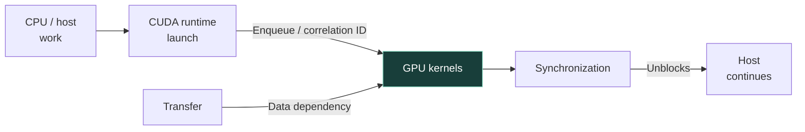
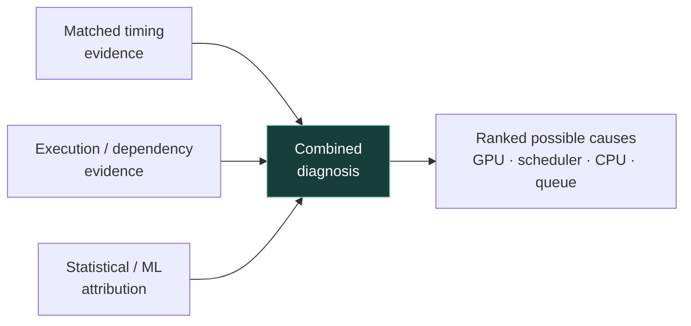
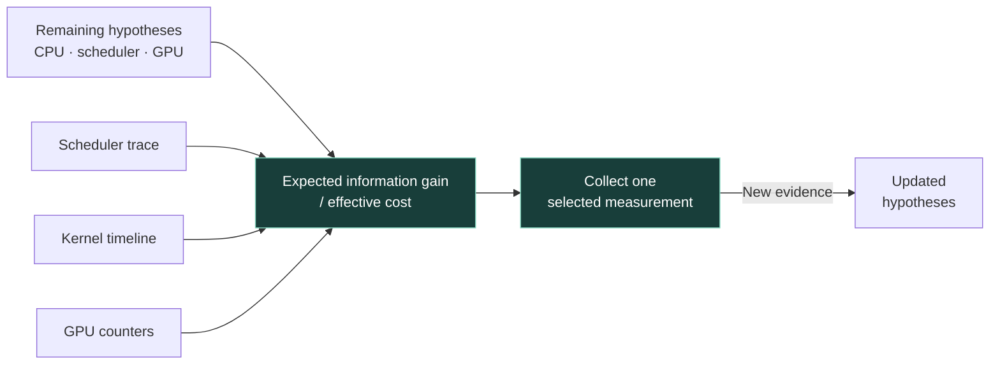
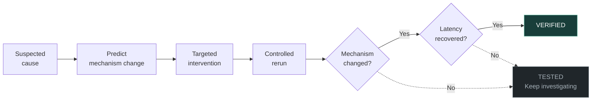
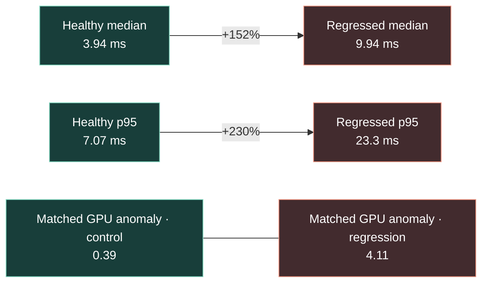

# Root demo — Mermaid source

See README.md for reveal order, explanations, and implementation notes.

## 1. Match the right healthy execution

## 2. Reconstruct where the work went

## 3. Combine evidence. Rank possible causes.

## 4. Choose the next useful measurement

## 5. Test the explanation

## 6. SmolVLA on NVIDIA T4

