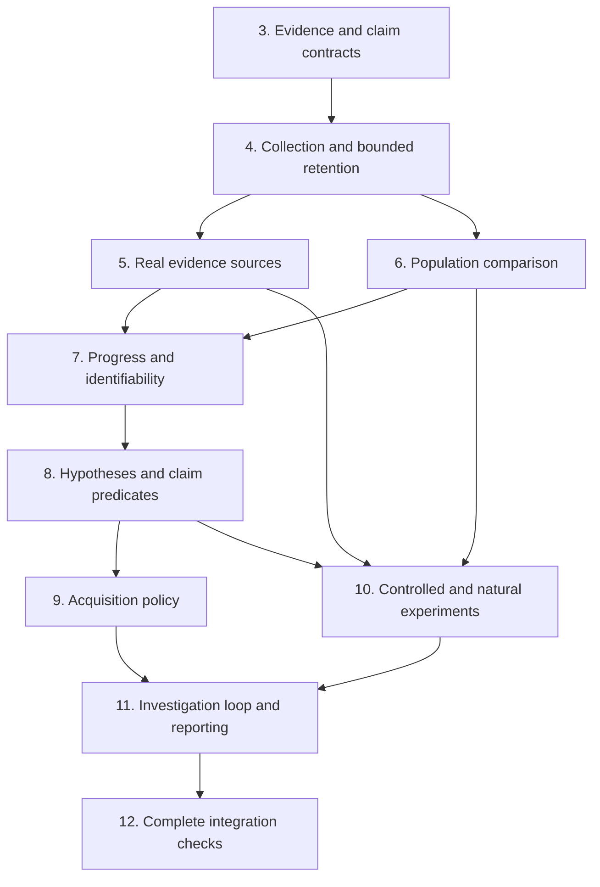

# Root network diagnosis: complete implementation plan

This plan implements [architecture.md](architecture.md) without changing its architectural decisions. The order below follows technical dependencies. It covers natural interventions, interaction diagnosis, distributed hindsight, infrastructure evidence, and topology-based inference. Expected-loss optimization is deferred until a concrete deployment supplies defensible predictive models and a declared loss policy; until then, use the qualitative acquisition policy.

The shortest faithful implementation is a local Python investigator using Root's existing ledger, buffer, experiment lifecycle, and report conventions; small endpoint collectors; native capture tools; and two new Python modules for network evidence and network analysis. The four architectural components do not become four services or four class hierarchies.

**1. Repository findings and implementation boundary**

Inspection baseline: commit `05afc1b5d9811286df9a00d65d4c7ab1bdd576bf`, plus the completed, currently untracked `architecture.md`. No implementation source was changed while preparing this plan.

| Existing code | Actual behavior | Implementation decision |
|---|---|---|
| `reflex/network.py:52`, `:113`, `:157` | Standard-library HTTP server/client, fixed payloads, request IDs, separate endpoint clocks, request JSONL and phase summaries. Each request opens a connection; the server explicitly closes it. | Keep the workload and CLI. Extend it with persistent connections, intended release/deadline accounting, bounded concurrency, instrumentation hooks, and investigation commands. Do not replace HTTP with a new networking stack. |
| `reflex/network.py:200`, `:210` | Descriptive completed-request statistics and strict equality across run metadata, including seed, request count, commit, and server identity. | Keep descriptive statistics and a legacy reader. Replace the comparison decision with the architecture's explicit comparison contract. Different deployments or server instances cannot be universally forbidden when they are the exposure being investigated. |
| `scripts/network_experiment.sh` | Isolated Linux veth/netns experiment, one server-egress impairment, sequential healthy/incident/recovery runs, before/after qdisc counters. | Reuse the isolation and cleanup. Extend to independently controlled directions, shared traffic, repeated assigned blocks, route alternatives, and evidence capture. Separate fault ground truth from investigator inputs. |
| `reflex/runtime.py:17` | `HindsightRing` is a count-bounded deque with aggregate drop counting. Runtime and calibration use FakeGPU and artificial sleeps. | Generalize the ring; do not reuse FakeGPU execution or sleep-based overhead estimates for network measurements. |
| `reflex/ledger.py` | Append-only JSONL, replay, evidence IDs, incidents, hypotheses, experiments, four evidence levels. `TESTED` currently requires only a linked experiment; `VERIFIED` requires only a non-null measured effect. | Reuse persistence and identity. Add versioned network claim and experiment contracts and enforce their stronger gates during writes and replay. |
| `reflex/collect.py:166`, `:174`, `:686` | Streaming hashes and manifest/checksum completion, but collection paths and ingest require GPU/fault/seed identities and GPU trace formats. | Generalize the small artifact-finalization helper; retain GPU wrappers. Do not send network records through Kineto conversion or fault-labeled corpus ingest. |
| `reflex/reconstruct.py:18`, `:180` | GPU-specific DAG and an offset estimate derived from known simulated launch/queue components. | Do not reuse its clock estimator, stage vocabulary, or additive critical-path attribution. Reuse its simple dictionary/list style, not its causal assumptions. |
| `reflex/diagnose.py:157`, `:484` | Hypothesis registry has useful support/contradiction concepts, but mutable working state is not fully ledger-derived. Diagnosis assumes GPU stages and assigns heuristic UNKNOWN mass. | Network hypotheses use the shared ledger directly. Do not create a second mutable registry, reuse stage scores, or normalize ignorance into a probability. |
| `reflex/select.py` | Six GPU actions, marginal likelihood tables, entropy/cost scores, signal-overlap halving, action-name deduplication, posterior commitment. | Add the network policy as plain functions in this existing module. Reuse shared setup-cost arithmetic after separating it from GPU groups. Keep existing GPU behavior isolated; its EIG implementation is not the network controller. |
| `reflex/verify.py:138` | Simulator knob changes, same-seed reruns, predicted-gap recovery threshold. | Reuse prediction-before-execution and measured-after-execution sequencing. Add population experiment evaluation and proof checks; do not use the simulator's 50% recovery gate for networks. |
| `reflex/report.py:191`, `:311` | Evidence-linked Markdown and an oracle, but renderer assumes one GPU winner and the oracle searches all ledger hypotheses for VERIFIED. | Add network rendering from incident-scoped claims. Generalize reference resolution and verify the exact claim/experiment/scope, including mixed verified and unresolved results. |
| `reflex/memory.py` | GPU schema, TF-IDF retrieval, graph reranking, shrunk intervention effects, extra ML imports. | For networks, scan completed ledger summaries with explicit context predicates. Reuse the ledger, not this retrieval stack or a new memory database. |

Graphify produced a map of the 24 product files: 560 nodes and 1,156 edges. Its extraction diagnostic reported 85 dangling endpoint edges and 91 undirected endpoint-pair collapses; direct source reads and call-site checks therefore determined the reuse decisions. The map is navigation, not proof of a call relationship.

The current network, ledger, runtime, and envelope baseline was executed: **19 tests passed**. This Windows host has no installed `ip`, `tc`, `perf`, or Wireshark capture commands. No privileged Linux or physical-network test is claimed here.

**2. Keep the code and process footprint small**

Use this final ownership map; it is not a request to scaffold additional layers.

| File | Final responsibility |
|---|---|
| Existing `reflex/network.py` | HTTP workload, endpoint application hooks, CLI, and the network investigation loop. Existing `run` remains the workload runner; add a separately named investigation function. |
| New `reflex/network_capture.py` | Network record validation/normalization, source capabilities, transport/native-tool capture, artifact ingestion, targeted probes, and local/SSH execution. |
| New `reflex/network_analysis.py` | Population summaries and comparison, clock-safe joins, episode views, progress relationships, mechanism predicates, and conditional topology inference. |
| Existing `reflex/runtime.py` | Generalized bounded ring, trigger/pin behavior, asynchronous drain, measured collector-overhead support. Move FakeGPU imports inside its GPU functions. |
| Existing `reflex/ledger.py` | Versioned records, durable investigation decisions, claim/experiment state and replay gates. |
| Existing `reflex/collect.py` | Small shared artifact completion/checksum helpers; existing GPU collection remains a caller. |
| Existing `reflex/select.py` | Network acquisition feasibility, prerequisite bundles, qualitative choice, optional conditional expected loss, and decision audit. |
| Existing `reflex/verify.py` | Network experiment evaluation and verification certificates, alongside the existing GPU runner. |
| Existing `reflex/report.py` | Network claim rendering and incident-scoped report validation. |
| New `reflex/network_probe.bt` | The narrow targeted Linux probes for missing socket/readability and queue boundaries. Native tools handle ordinary packet and scheduler tracing. |
| New `requirements-network.txt` | DDSketch plus NumPy/SciPy used by network analysis; no GPU training dependencies. Pin versions exercised by the network checks. |
| Existing `tests/test_network.py` plus new `tests/test_network_analysis.py` and `tests/test_network_investigation.py` | Acquisition/real traffic, pure analysis, and controller/verification/end-to-end checks respectively. Shared primitives retain their existing test files. Small raw format fixtures live together under `tests/fixtures/network/`. |

A targeted probe source earns a separate file because it is compiled/interpreted by another tool and has a different compatibility boundary. Do not hide it in a long Python string to reduce the file count cosmetically.

Move GPU-only imports in `select.py`, `verify.py`, and `report.py` into their GPU entry points where necessary. Importing the network investigator must not import scikit-learn, LightGBM, MAPIE, Torch, or the GPU incident-memory implementation. Do not reorganize unrelated GPU code.

Use the standard library for records, JSONL, counters, deques, hashes, subprocesses, scheduling, and bounded worker queues. Reuse the [DDSketch implementation](https://github.com/DataDog/sketches-py) instead of writing a quantile sketch. NumPy/SciPy already appear in this repository's dependency set; use them for numerical arrays, randomized-test utilities where appropriate, and linear programming. Do not add pandas, a graph database, an ORM, a workflow engine, or a model-serving process.

One investigator owns its ledger. Each instrumented endpoint owns its bounded collector state and spool; it can run in the application or as the same CLI invoked locally or through existing SSH. Native profilers are child processes only while their acquisition is active. No coordinator service, message broker, fleet agent, or always-running packet exporter is required.

The dependency order is:

Checks named below belong with their owning change and must pass before a dependent change treats that behavior as reliable. Section 12 connects the already-tested pieces; it is not a postponement of validation.

**3. Establish the evidence and claim contracts**

Extend the existing ledger records, rather than adding an entity hierarchy for every architectural noun. Keep domain facts in validated payloads and add explicit domain/scope metadata where the ledger must enforce lifecycle rules.

Use these concrete representations:

| Concept | Representation and required content |
|---|---|
| Source capability/coverage | Evidence payload containing endpoint, process/boot instance, source/version, clock, supported boundaries, identity precision, sampling/filter configuration, covered intervals, drops, retention horizon, resolution, and access requirements. A source is available only after probing it successfully. |
| Measurement/event | `Evidence` plus source-stable identity, local sequence, clock and local time/interval, boundary, values/units, identity links, raw artifact reference, and measurement limitations. Derived facts list input evidence IDs and the derivation version. |
| Delivery | An ID plus release, submission, deadline, progress and terminal events. Keep eligibility/outcome counters independently of detailed event retention. A projection references these facts; it is not another mutable source of truth. |
| Comparison contract | Incident evidence with target population, outcome, exposure, comparable variables, mediator exclusions, support limits, reference IDs, selection rule, dependence unit, estimand, material threshold, and inferential error allocation. Hash the immutable contract. |
| Episode | A view containing event/observation references, local windows, predecessor/shared-exposure references, and unknown initial-state markers. Overlap is allowed; duplicate observations are not new evidence. |
| Claim | Extend `Hypothesis` with a structured claim scope: mechanism, location, population/contract, outcome, regime, assumptions, support/contradiction IDs, alternatives, and experiment links. Existing hypothesis ID is the claim ID. Separate mechanism/location/effect support; do not add one global confidence number. |
| Acquisition/experiment | A recorded plan, scope, prerequisites, predicted outcome predicates, affected claims, assignment/replication units, resource budgets, readbacks, actual execution/result, and conclusion. An experiment may test several claims without duplicating its observations. |
| Closure | Incident evidence containing the supported claims, unresolved distinctions, and operational reason: adequate scope, no considered feasible discriminator, evidence expired, regime changed, or a specific exhausted budget. |

A request can span many stream ranges and packets; a packet can contribute to several messages. Store links as small lists with explicit relation types and certainty, not a single universal correlation ID. Flow identity includes connection incarnation and direction; 5-tuples alone do not survive reuse, NAT, or QUIC migration. Socket identity includes an endpoint lifetime and cookie where exposed. Clock identity includes its source and restart instance.

Raw event identity is `(source instance, source sequence)` or an artifact hash plus record position. Map it deterministically to ledger-compatible IDs. Reingesting identical data is a no-op; the same identity with different content is an error. A shared acquisition used by two incidents has one observation identity and separate incident-reference evidence, not two independent observations. Evidence dependencies point to raw identities as well as derived records.

Add a schema version with a read path for existing version-1 logs. Preserve their recorded semantics as `legacy`/GPU semantics. Do not reinterpret an old VERIFIED transition as having passed the new network gate. Existing GPU callers retain their behavior; every new network record explicitly selects the network contract, so omission cannot bypass its checks.

For network claims, replace the ledger's current non-null-effect promotion rule with validation of linked execution and verification evidence. `TESTED` requires an executed, valid discriminating contrast and established exposure/manipulation; an action that failed before applying anything stays an attempted acquisition. A valid test with an inconclusive or adverse outcome remains TESTED. `VERIFIED` requires the certificate described in section 10. Preserve failed checks as evidence. Later contradictions append a reassessment/supersession; never erase an earlier conclusion or present a superseded claim as current.

A prediction may be qualitative or an effect interval; `predicted_delta_ms` must not be mandatory for every network experiment. Support deadline-probability changes and bounded effects without inventing a point prediction. Validate finite numbers, units, referential integrity, incident membership, and plan-before-result order during replay as well as at write time. An arbitrary `Evidence(level=VERIFIED)` payload must not substitute for a verified claim transition.

Keep the pure network transition/certificate validator in `ledger.py`, accepting resolved records rather than importing the experiment runner. `verify.py` computes experiment results; ledger writes, ledger replay, and report validation invoke that same validator. This avoids a ledger/verification import cycle and three different definitions of VERIFIED.

The ledger remains a small decision/evidence-reference log. High-volume raw captures remain in checksummed artifacts. Stream replay instead of loading the whole file as one string. Handle a torn final append as an explicitly reported incomplete tail; malformed committed records fail validation. Flush durable experiment plans before executing mutations. Keep the single-writer contract rather than adding distributed locking.

**Validation before use:** round-trip old and new logs; reject forged cross-incident verification, non-finite values, duplicate-content conflicts, unsupported schema versions, result-before-plan, and failed-action promotion. Restart must reproduce claim support, consumed error budgets, acquisition costs, and closure state. Two episodes referencing one retransmission must still count one raw observation.

**4. Connect application instrumentation to bounded collection**

Extend the existing HTTP path rather than building another workload. Add persistent connection mode and explicit connection IDs; keep fresh-connection mode because connection setup is a real contrast. Persistent mode must not automatically retry an ambiguously completed request. Record a retry as a distinct attempt linked to its logical delivery.

Add a monotonic intended-release schedule independent of completion for scheduled workloads, plus the existing completion-driven mode with its feedback dependence recorded. A bounded worker pool provides concurrency. Record scheduled releases that could not be dispatched; never silently reduce offered load when the client is late. Each attempt has a deadline, submitted/not-submitted state, timeout/cancellation semantics, and terminal or right-censored outcome. Server logs preserve requests that outlive the client timeout.

Expose small callable application hooks in `network.py` for production callers: release/readiness, submit, stream/message progress, useful completion/consumption, cancellation, and outcome. The HTTP workload calls the same hooks. Server work stays an opaque interval. Do not require the diagnostic HTTP headers from an arbitrary server; missing server IDs or work durations reduce scope rather than making one-endpoint operation impossible.

Correct existing field semantics:

- `client_send_start_ns` currently precedes connection establishment and `conn.request`; name its boundary accordingly and separately record connection and socket-write intervals.
- `sent_ns` is completion of a userspace write/flush, not wire departure.
- `client_receive_end_ns` records return from reading the body, not the instant all bytes first became readable.
- Remove `max(0, ...)` from residual formation. An impossible residual signals invalid nesting, duration conversion, or source data; retain the raw values and refuse that derived interval.
- Prefix request IDs with a unique execution identity; `{seed}:{phase}:{index}` can collide across independent runs.

Generalize `HindsightRing` with record-count, byte, and age limits, source sequence coverage, and a pin operation. Use one small mutable ring object with a lock only around push/snapshot/pin bookkeeping; never hold it during disk or network I/O. Serialization and export run through a bounded drain queue. Population counters update independently of the detail queue. Exhaustion records a coverage gap and drop count; it cannot block the robotics loop indefinitely.

Pinning transfers/references selected records into a separately budgeted retained batch before normal eviction. It also arms a bounded post-trigger window. If pin capacity is exhausted, preserve the available portion and mark precisely what was lost. The existing snapshot-then-clear behavior must not discard observations added while a flush is in progress. A trigger captures each live event once; it must not replay already-consumed generator events as a post-window.

Maintain low-cost counters and DDSketch summaries per declared population/time block, ordered miss-run/drought summaries, and a small uniform reservoir of ordinary delivery views. Record inclusion probabilities and whether selection was trigger-based. The reservoir supports inspection and exploratory comparisons, not an exact denominator or unrestricted post-hoc causal estimate. Bound cohort cardinality; overflow becomes an explicitly coarser population and cannot later claim unavailable stratification.

Carry prefix/suffix run state across adjacent summary blocks, so a drought or missed-delivery run crossing a boundary is not split into apparently independent short runs. Count logical deliveries and retry attempts separately, with exactly-once terminal accounting per identity. Unknown/censored outcomes remain separate from successes and known deadline misses.

Distributed hindsight uses the same capture command on each reachable endpoint. A pin request names recorded delivery/flow/resource identities and local sequence/time windows. Return the retained records plus coverage, including unavailable predecessors. If clocks are unrelated, propagate IDs and local causal landmarks rather than one global timestamp range. Late requests can fail because retention expired; a new capture observes recurrence only.

Generalize artifact completion in `collect.py` to accept an explicit directory and manifest. Keep existing GPU path wrappers. Write the manifest before collection, append bounded chunks, finalize each closed artifact with streaming hashes, then mark completion. Incomplete captures remain useful only over verified covered ranges. Use flat validated artifact names and path containment. Do not copy the existing GPU-required fields or default missing drop counts to zero.

**Validation before use:** persistent and fresh HTTP runs; missing server headers; concurrent releases; timeout before/after deadline; cancellation; lost completion; collector overflow; byte/age eviction; overlapping pins; delayed remote pin; source restart and ID reuse; process death during artifact finalization. Removing all detailed rows must leave the population denominator correct, with the loss explicitly reported. Verify bounded memory and that a stalled writer does not stall application callbacks beyond the stated bound.

**5. Implement every evidence source through a small finite capture catalog**

`network_capture.py` contains named functions and a table of supported source profiles. Use direct callables and explicit command builders, not entry-point plugins, adapter base classes, or a schema-transformation language. Retain raw output and parser/tool versions. Unsupported formats fail closed or preserve an opaque artifact; absent fields never become zeros.

| Evidence capability | Simplest concrete implementation and required semantics |
|---|---|
| Application and opaque service boundaries | Hooks from section 4; import the existing client/server JSONL with a `network-v1` reader that marks its missing capabilities. |
| TCP/socket progress | For owned sockets, `getsockopt(TCP_INFO)` at lifecycle/progress/stall events, byte counters, connection identity, and queue sizes where exposed. Decode only the returned, tested Linux ABI prefix; preserve raw bytes and size. For unowned sockets, use native socket diagnostics with PID/netns/cookie identity when available. Snapshots carry sampling intervals and cannot exclude transitions between reads. |
| Transport transitions | Capture supported retransmission/state trace events and the small targeted probe's state changes. Retain recovery/cwnd/rwnd/pacing/application-limited evidence only when the source exposes it. Never infer a complete congestion window history from endpoint packet counts. |
| Packets and ACKs | Use `dumpcap` for bounded filtered pcapng capture and `tshark` for selected fields, sequence/ACK ranges, flags, sizes, and capture metadata. Keep dissector retransmission/loss labels as inferred annotations. Preserve raw packet identities and distinguish a missing capture from a missing packet. |
| Scheduler and execution | Use `perf sched`/`perf script` and native scheduler events. Normalize runnable-to-running, blocked, preemption, thread identity, and lost-event intervals. A wakeup or runnable delay does not establish complete-message readiness; join it to that separate boundary. |
| Kernel ingress, socket readability, queue intervals | `network_probe.bt` supplies narrowly scoped probes where standard events lack the required association. On a tested BTF/kernel layout, observe socket readiness and contiguous receive progress, plus relevant enqueue/dequeue boundaries. Correlate by socket lifetime/sequence ranges and queue identity. Probe availability and semantics are tested before enabling a profile; partial data produces intervals/unknowns. Filter by the selected socket/process/interface and bound collection duration. |
| NIC/software timestamps and clock mapping | Use Linux `SO_TIMESTAMPING` on supported owned sockets and available timestamped capture output. Collect generation point, timestamp ID/byte association, clock ID, and device capability. Ingest externally established offset/rate bounds and their validity interval; local clock bracketing supports same-host mappings. PTP being enabled is not a sufficient bound by itself. |
| Route and shared-path context | Record local route/interface configuration and route-change events using `ip`; import historical flow-relevant path observations. Targeted path probes are separate traffic with explicit flow correspondence limits. Preserve path-incarnation and ECMP uncertainty. |
| AP/wireless | Collect available station/survey counters through `iw`; import per-station AP/driver queue, eligibility, access, retry, delivery, and link-assignment events through the normalized record contract. Include a tested raw AP-event fixture and actual parser. Counter deltas alone cannot verify contention or fabricate access delay. |
| Relay and programmable infrastructure | Use the same application hooks at controlled relay ingress/release/egress. Accept and validate source-produced ingress/egress or enqueue/dequeue event exports, including packet/request mapping, clock domain, units, drops, and sampling. Include parsers/fixtures for the documented normalized JSONL export, not a placeholder callback. Switch residence and queue sojourn are distinct event types. |
| Known topology | Import a concrete path-incidence table with route epoch, measured intervals, endpoint contribution bounds, and resource identities. The solver in section 7 consumes this table only after validating the measurement assumptions. |
| QUIC/multiplexing | Parse explicitly supported qlog versions into packet, stream-offset, ACK/loss, flow-control, and connection-migration events; join application message boundaries where supplied. Unknown schemas and missing plaintext/message mappings retain uncertainty. Do not infer TCP recovery rules for QUIC. |

[Dumpcap](https://www.wireshark.org/docs/man-pages/dumpcap.html) already supplies duration/size limits and rotating capture files; [TShark](https://www.wireshark.org/docs/man-pages/tshark) supplies field extraction. Pin only closed segments and verify their hashes; copying a file while the capture tool can overwrite it is not a valid pin. A short capture stop/rotation gap must be recorded rather than hidden.

[Linux timestamping](https://docs.kernel.org/networking/timestamping.html) distinguishes timestamp generation points, hardware clocks, and transmit error-queue reports. [Kernel event formats](https://docs.kernel.org/trace/events.html) expose actual fields for validating probe parsers. [Perf scheduler tracing](https://github.com/torvalds/linux/blob/master/tools/perf/Documentation/perf-sched.txt) already distinguishes runnable scheduling delay from other waiting. These tools replace custom packet decoders and scheduler profilers, not the causal joins Root needs.

[Wireless station statistics](https://wireless.docs.kernel.org/en/latest/en/users/documentation/iw.html) provide limited link observations; richer AP service events require a capable source. [Qlog's versioned schemas](https://github.com/quicwg/qlog) provide transport event vocabulary. Record the supported version and reject silent reinterpretation across versions.

All levels are completed in this plan: live acquisition where a standard interface exists, functional ingestion and analysis for source-produced richer telemetry, and explicit unavailable outcomes elsewhere. Root does not need a custom driver for every AP or a P4 program for every switch. It does need to consume, acquire when connected, and reason over the rich evidence rather than merely store an opaque file. No physical source is assumed to exist universally.

For the custom probe profile, start with supported socket state/retransmit and scheduler tracepoints; use BTF-checked TCP receive-queue/readability probes only for the missing sequence association, and queue enqueue/dequeue probes only for the selected resource. Record attachment points and field layouts as part of the source profile. A readability callback proves that some data is readable, not that the response is complete: the complete-data predicate additionally needs the required message's contiguous byte/stream range. TLS, buffering, or absent framing can prevent this join. Reject unsupported probe layouts instead of guessing offsets or attaching a superficially similar function. The optional native tools are Wireshark CLI, perf, bpftrace, iproute2, and iw; none is imported into the pure-analysis path.

Run collectors locally or through a fixed SSH invocation of the same CLI; use argument lists, explicit endpoint profiles, deadlines, cancellation, and process cleanup. No model-selected arbitrary shell command. Diagnostic experiments only mutate the explicitly scoped workload/netns/resource with a recorded restoration action.

**Validation before use:** each parser has a small real-format fixture plus malformed, truncated, unknown-version, counter-reset, missing-field, and loss-of-coverage cases. On Linux, exercise TCP, packet, scheduler, socket-readiness, and queue profiles against the isolated workload. Check offload/coalescing, sequence wrap, reused sockets, encryption, and stream multiplexing. Physical AP/NIC/infrastructure checks validate actual source semantics where that hardware exists; their absence is reported as an unvalidated source profile, never counted as a passing hardware check.

**6. Implement population comparison with a concrete inferential contract**

Put these functions in `network_analysis.py`. They consume normalized records and a frozen comparison contract; they do not choose a favorite cause.

The continuous summaries include exact eligible/completed/failed/missed/unknown-deadline counts, DDSketch durations, fixed-threshold exceedance counts, censored outcomes, ordered runs, and block identities. A timeout before the delivery deadline is not automatically a known deadline miss; record the outcome and the applicable bounds. Completed-only percentiles remain explicitly conditional.

Use DDSketch with a declared relative accuracy and bounded collapsing store; persist parameters, bins, counts, and collapse range through a small versioned serialization adapter. Merge only compatible summaries. Keep exact deadline/threshold counts separately, so sketch approximation never becomes an exact deadline count. Quantiles in collapsed or unsupported ranges are bounded/unavailable as appropriate, not silently precise.

Construct comparisons by filtering explicit attributes and exact strata or declared numeric bins. This is ordinary dictionary grouping, not nearest-neighbor matching. Compute both total-population change and a standardized conditional comparison with frozen target weights where requested. Retain unsupported strata and the excluded fraction. Different causal roles produce separate contracts and estimates, not a merged answer. Keep reference data immutable for an unresolved incident.

Use a conservative, concrete default detector rather than porting a research theorem incompletely:

- Define bounded block statistics for deadline/threshold exceedance, empirical CDF points, miss-run exceedance, and delivery-drought exceedance. Preserve their event ordering before aggregation.
- State the independent/exchangeable or otherwise justified replication unit in the contract. Blocks can contain correlated requests; a fixed arbitrary block size is not proof that blocks are independent. If the declared dependence assumption is unsupported, provide descriptive differences and uncertainty limits without a formal regression declaration.
- For an independent-block comparison, use weighted bounded-mean concentration intervals. With normalized, fixed weights `w_b` and block values in `[0,1]`, use radius `sqrt(log(2/delta) * sum(w_b^2) / 2)`, capped by the range. Combine reference/current intervals by interval subtraction. These estimate the declared weighted block target; do not silently relabel an equal-block estimate as an all-request rate.
- Freeze weights/sample sizes before the relevant observation when required by that bound. If outcome-dependent block sizes invalidate this scheme, use fixed eligible-attempt units or report the descriptive attempt-rate target separately. Do not retrofit weights to obtain significance.
- Allocate a summable error budget over contracts, outcomes, and scheduled looks. For example, preallocate contract/outcome weights and use `delta_k = allocated_alpha / (k * (k + 1))` across looks. Count both reference and incident bounds. Repeated reference use does not consume imaginary new observations.
- Declare regression only when the lower bound on the relevant increase exceeds the contract's material threshold. Predeclared CDF thresholds detect distribution changes; burst/drought outcomes detect temporal changes. Quantile displays remain descriptive unless an appropriate CDF band can be inverted over supported thresholds.

This is intentionally conservative and conditional on the recorded sampling/dependence assumptions. It is a complete functioning detector, not a universal guarantee for arbitrary stochastic processes. Do not add an automatic block-size estimator that claims to prove independence.

Maintain an exploratory/confirmatory flag and frozen selection timestamp for every contract. Exploration can nominate a new cohort or relationship; confirmation uses later eligible blocks with separately allocated error budget. This avoids implementing a general selective-inference framework. Alternative hypotheses/contracts that cannot be distinguished remain visible. Loss of overlap, uncontrolled regime change, or insufficient retained detail yields an explicit unresolved comparison.

**Validation before use:** known weighted-rate examples; exact denominators under censoring; sketch merge and approximation bounds; independent-block simulations with predeclared false-alarm tolerances; dependent-block data refused under an unsupported contract; identical marginal/different joint examples; serial bursts; workload-mix drift; normal-tail controls; matching on a proposed mediator prohibited; adaptively found cohort unable to confirm itself; restart unable to reset the error budget. Use the existing pytest stack and seeded, fixed-repetition simulations, not an additional statistical testing framework.

**7. Reconstruct progress and calculate identifiable bounds**

Use dictionaries indexed by source identity, delivery, connection incarnation, stream range, queue/resource, and local sequence. An episode is a list of references and boundary limits. Build only the relationships used by the active comparison or claim predicate. No permanently materialized graph database and no universal packet DAG.

Implement local durations, explicit protocol order, and bounded clock transforms separately. A clock transform has scale/offset bounds, source evidence, and a validity interval; compose bounds conservatively and invalidate on restart or expiration. Cross-domain subtraction returns an interval only with such a transform. Same-clock ordering survives without global alignment. The strictly nested client-minus-server elapsed-time residual uses duration scale bounds and retains its composite meaning. Streaming/overlapping server boundaries cannot use that residual formula.

Build interval/range joins for required data. Preserve original transmissions, retransmissions, ACK observations, partial delivery and reassembly, and useful-message completion separately. A shared queue/resource edge establishes possible exposure until more precise evidence exists. Cycles in mechanism feedback are represented as state relationships; only concrete ordered events are eligible for temporal DAG operations. Do not sum uncertain or overlapping waits to obtain request latency.

Use the same comparison engine for local intervals and declared joint statistics: simultaneous threshold exceedance, phase/ordering changes, conditional progress, and shared-resource exposure. The exact `(1,11)/(11,1)` versus `(1,1)/(11,11)` counterexample must identify a changed relationship even when both marginals are identical. A current gating delay, a masked delay, and an initiating mechanism are different facts.

Return localization as supported intervals/dependencies plus unresolved regions, not an `argmax(stage)` winner. “No detected upstream difference” is not equivalence; an equivalence statement needs an interval within a declared tolerance and adequate coverage. Coverage holes propagate through every derived fact.

For topology inference, use SciPy `linprog` on the supplied nonnegative additive-delay constraints and measurement bounds. First subtract only known/bounded endpoint contributions and reject inconsistent route epochs or unsupported additivity. Minimize and maximize each candidate resource delay over the feasible set; report intervals and indistinguishable resource groups. Also compute bounds for any claimed group. An empty feasible set is model inconsistency; an unbounded/underdetermined quantity remains unresolved. Do not select a sparse point solution and call it a located fault. This supplies the architecture's conditional hidden-resource inference without a custom compressed-sensing solver.

**Validation before use:** arbitrary clock offsets leave local durations unchanged; rate uncertainty widens residuals; invalid nesting/negative residual is rejected; unrelated clocks never yield one-way delay; packet coalescing and retransmission do not duplicate delivered bytes; relay joins without identity stay uncertain; queue/cwnd state predating retention is marked unknown. Test non-additive and rank-deficient topology inputs, not only a uniquely solvable path matrix.

**8. Encode mechanism predictions and scoped claims**

Use a flat table of mechanism names, required facts, predicate functions, candidate discriminators, and research provenance in `network_analysis.py`. This is executable code with explicit inputs, not a rules DSL. Predicates return `supports`, `contradicts`, or `unresolved`, with evidence IDs, assumptions, scope, and the reason. Only a covered invariant or a valid statistical contradiction can eliminate a stochastic explanation.

Implement the following predicate groups and their distinguishing boundaries. They are reusable facts within mechanisms, not separate services or mutually exclusive fault classes:

| Predicate group | Required discrimination |
|---|---|
| Readiness and endpoint service | Intended versus actual submission; complete required data readable versus application consumption; runnable versus blocked intervals. |
| Sender/socket restriction | Pending application data, accepted bytes, not-yet-sent bytes, flow/congestion window, pacing, and actual egress where observed. Missing state leaves the restriction unresolved. |
| Delivery drought and recovery | Work pending at a named boundary; missing required sequence/stream range; repair/reassembly followed by useful progress. Recovery can be supported without identifying physical loss. |
| Queue/service accumulation | Observed arrivals, departures/backlog and actual queue sojourn versus aggregate switch/relay residence. Distinguish prior backlog from new growth. |
| Serialization/bandwidth | Bytes and observed service interval at a defined resource; rate/window/pacing alternatives; no physical-capacity claim from goodput alone. |
| Wireless access | Eligibility and queue/link-assignment/access/retry boundaries. Generic endpoint recovery is insufficient for contention. |
| Path and relay behavior | Historically observed path/regime or relay release changes with correspondence limits. Current traceroute is not historical proof. |
| Reverse feedback | Feedback generation, arrival spacing, sender gating, and feedback direction; forward transmission stalls can be effects of reverse impairment. |
| Interactions and multiple causes | Shared exposure, ordering changes, masked dependencies, and mediator/outcome responses under conditional/joint contrasts. |

Start from observed blocked-progress relationships and construct the applicable mechanism chains/structures. Add explicit compounds when facts identify interacting resources or when one explanation leaves evidence unexplained; do not enumerate the power set of all fault labels. A bounded candidate search records unexplored compositions, so its exhaustion cannot certify that all causes were considered. Direct interval/intervention claims can remain useful for a novel mechanism absent from the table.

Derive working hypothesis state from ledger facts on restart. Keep one support record per observation/derivation and retain correlation groups. No UNKNOWN probability is fitted from anomaly magnitude; the open-world qualification persists even if one known candidate fits perfectly. Repetition of the same source or episode is not fresh evidence. Evidence of a new regime can reopen a suppressed explanation without rewriting history.

Previous investigations are found by scanning their final summaries using explicit context and capability filters. They can nominate a mechanism, suggest an acquisition, or supply a provenance-labeled model/cost estimate. They cannot enter the current incident's support set as current causal evidence. No embeddings, TF-IDF network index, or second incident database is needed.

**Validation before use:** positive and near-miss examples for each predicate; one missing prerequisite makes the result unresolved; loss/recovery/cwnd counters from the same event do not multiply support; renamed/duplicated hypothesis variants do not change diagnostic choices. An unseen relay-release mechanism that fits a queue signature cannot obtain a verified queue claim from library exhaustion. Test compounds with masking even when one single mechanism fits the endpoint tail.

**9. Implement the acquisition controller without fictional probabilities**

Add a plain `choose_acquisition`-style function to `select.py` over the current claim distinctions, feasible capture/experiment records, acquired observations, and budget state. Keep the old GPU selector isolated. Reuse its setup-cost idea, not entropy scores, reliability multipliers, fixed overlap discounts, UNKNOWN redistribution, or posterior commitment thresholds.

An acquisition row contains: action and scope, required capabilities, prerequisites, claim distinction, interpretable outcome predicates, inconclusive conditions, prediction basis, resource keys, cost/time bounds, perturbation limits, recurrence requirements, execution function, and result parser. Its identity includes scope/epoch/input evidence; an action name is not a lifetime ban on collecting new evidence.

Implement the architecture's qualitative order exactly:

1. Preserve threatened history within budget before ranking ordinary acquisitions.
2. Pick the next unresolved claim distinction using the incident's declared scope priority; default to outcome-gating boundary, proximate mechanism, then initiating mechanism/location.
3. Form feasible bundles from the finite action table and transitive prerequisites. Include paired endpoints, clock calibration, shared capture setups, and specified joint interventions. Do not search every subset of all actions.
4. Remove bundles with no justified claim-changing interpretable outcome. Allow overlapping outcome compatibility sets; a stochastic observation need not eliminate a hypothesis to narrow a supported claim or effect interval.
5. Remove only demonstrably dominated bundles. Compare covered distinctions, prerequisites, coverage, and supported cost bounds; uncertain comparisons remain ties.
6. Apply explicit scope preference and conservative time/resource/perturbation bounds. Use stable action ID as the final disclosed tie-break, not as an implied optimality result. Unknown cost requires an enforceable cap before admission; an unbounded recurrence wait is not an admissible action.

Resources are keyed by actual endpoint/source/filter/interval/setup compatibility. A process-wide map of active acquisitions within the investigator avoids charging or running the same setup twice across overlapping incidents. Reuse shared result IDs. It is not a cross-host scheduling service. Incremental costs include activation, recording, pinning, export, analysis, waiting, and operating impact. Record estimated and realized values separately.

Defer expected-loss optimization until a concrete deployment provides validated predictive models, a declared loss over permissible claims, and enough evidence to assess calibration and scope. The qualitative acquisition policy is the complete implementation for the current use case; a future model-based policy must fall back to it whenever predictions are out of scope or too uncertain.

Measure observer effects with actual collectors off/on over comparable assigned blocks, using deadline/tail and coverage outcomes as well as CPU/bytes/time. Reuse runtime scheduling support but replace artificial sleep costs for this path. Historical mean overhead does not certify a tail bound. If instrumentation changes the regime, retain that result and restrict interpretation of the capture.

**Validation before use:** a multi-boundary capture beats several redundant tests; already acquired identical evidence has no new benefit; a new epoch can justify the same action again; paired endpoints count shared setup once; missing prerequisites/permissions prevent execution; unreliable coverage yields inconclusive. Duplicate ontology labels must not change selection. Check calibrated small joint-table decisions by brute-force enumeration, correlated outcomes, wrong calibration, unknown outcomes, changing action ranking under model bounds, no-model operation, and all stop limits.

**10. Implement controlled and natural experiment verification**

Add network experiment functions to `verify.py`; use one lifecycle for observations, controlled interventions, and qualified natural contrasts. Do not call `apply_intervention(FaultProfile)` or carry over fixed p99 recovery fractions.

Before execution, durably record the target claim(s), comparison contract, eligible population, intervention/exposure, predicted mediator and outcome changes, rivals with different predictions, material thresholds, assignment unit, replication unit, assignment schedule/seed, carryover/washout rule, budget, manipulation readback, and restoration. Freeze exploratory selections before confirmatory data arrive.

Implement paired or cluster-randomized time/resource blocks, with a bounded assignment schedule and repeated independent units appropriate to the shared queue/connection. Do not randomize requests independently when they interfere through shared state. Record initial-state observations before each block. Washout is a measured condition such as queue drainage or a specified connection reset, with a timeout; expiration makes the contrast invalid/inconclusive rather than silently treating a lingering queue as treatment effect.

Reuse the isolated experiment script for rate/pacing, competing-load removal, queue/shaper settings, scheduling interference, and route choices. The action table connects each to explicit readbacks and expected facts. Production control uses only supplied, scoped executors with the same contract. An opaque executor without exposure readback can yield an attempted action or broad effect observation, not a narrow mechanism verification.

Evaluate repeated block outcomes through section 6's comparison functions and, for randomized assignments, a test respecting the actual assignment scheme. A simple exact/enumerated or seeded Monte Carlo randomization test is sufficient; label finite simulation error. Keep effect estimates/intervals and material significance distinct from a p-value. Correct across tested outcomes/contrasts using the preallocated error budget. Testing several interventions and choosing the best afterward does not provide its own confirmation.

For natural interventions, ingest the externally recorded exposure and control assignments plus evidence/assumptions supporting exogeneity, overlap, stability, and no simultaneous alternative change. Compute the same predeclared contrast; use a matched difference-in-differences contrast when its parallel-trend assumption is declared and supported. Pretrend checks do not prove that assumption. If assumptions cannot be supported, retain an observational association. A natural experiment is not verified because a user supplied `exogenous: true`.

The verification certificate is a structured derivation, not a trusted boolean. It references the frozen plan, actual manipulation/exposure records, relevant mediator evidence, population effect estimate and inferential method, coverage/clock checks, interference/carryover checks, rival-prediction results, residual degradation, and the exact supported scope. The ledger/report validator checks reference integrity and recomputes the gate from those records.

Keep three claim scopes distinct: intervention effect, mechanism contribution in the tested regime, and historical responsibility for the original regression. A later recurrence does not reconstruct the original incident. An intervention altering several pathways can verify a broad effect while leaving the mechanism inferred. A masked mechanism can be TESTED with an observed mediator improvement and no verified end-to-end contribution until a joint/conditional contrast resolves it. Report interaction effects without adding independent p99 reductions.

**Validation before use:** failure before manipulation stays untested; valid negative and inconclusive tests remain TESTED; broad substitutions cannot verify a specific queue; missed manipulation/readback, changed workload, shared-resource interference, carryover, and outcome-dependent sampling block promotion. Include natural contrasts with and without justified controls, repeated treatment selection, the 80/100 ms masking example, and forged/reused certificates. Restoration runs on success, failure, timeout, and cancellation, with its outcome recorded.

**11. Wire the single investigation loop, report, and replay**

Add network CLI commands for capture/ingest, investigate/resume, and report alongside the existing `serve`, `run`, and `compare` commands. Keep one explicit loop in `network.py`:

1. Ingest available observations and source coverage; preserve expiring history.
2. Load/freeze comparison contracts and units; compute descriptive and justified inferential results.
3. Construct the necessary episode views and progress/interaction facts.
4. Update scoped candidates, contradictions, indistinguishable groups, and claim support from the ledger.
5. Evaluate existing test results and current claim gates.
6. Check adequate scope and actual stopping limits.
7. Select one feasible acquisition bundle, durably record its reason and expected predicates, execute, ingest, and repeat.

There is no compulsory localization-before-intervention ladder. A topology observation, scheduler trace, natural contrast, or controlled intervention enters the same loop. The server's computation remains an opaque interval.

Resume replays decisions and acquired evidence. In-flight acquisitions become unknown/failed execution until their artifacts/readbacks establish what occurred. Never rerun an uncertain intervention automatically just because its result append is missing; reconcile its identity and current state first. Ordinary read-only captures can be retried with new acquisition identities and explicit prior coverage gaps.

Expose existing `show-me` rendering through a network branch in `report.py`, with the exact incident and domain carried in the summary. Render population change, comparison support, episode/progress view, clock/coverage limits, claims by level, alternatives, action choice and realized cost, experiment effects, and closure reason. A verified contribution and unresolved remainder can appear together. No single VERIFIED badge for the incident, no zero-filled missing intervals, and no promise of expected recovery without supporting evidence.

Generalize the existing evidence-reference oracle to check each rendered claim's incident, contract, scope, source references, active/superseded status, and experiment certificate. The text is rendered from the validated structured result. An unrelated verified hypothesis elsewhere in the ledger cannot authorize this report. Empty or missing evidence yields explicit unknowns.

Keep report text deterministic: validate the structured claim projection and its canonical rendering, rather than introducing an NLP system to decide whether arbitrary prose overstates causality. The existing GPU report remains on its existing rendering path.

Replay means deterministic re-analysis of recorded evidence and recorded choices; it is distinct from regenerating a stochastic network event. Re-running a workload is a new experiment, with its own clocks, initial state, eligible population, and provenance.

Write a compact final summary into the existing incident ledger for future context-filtered retrieval. It records useful acquisitions and their measured costs without transferring previous conclusions into current evidence. Update the README with the new commands, observability limits, optional tool dependencies, and precise distinction between tested fixtures, Linux integration results, and physical-source validation.

**Validation before use:** live versus replayed analysis produces the same claims and reasons; restart at every acquisition/experiment boundary; missing remote endpoint; all capabilities exhausted; changed regime; spent time/bytes/perturbation budget; unresolved original history with successful recurrence test. Mutate a report to overstate scope, substitute another incident's evidence, or remove coverage caveats and require the validator to reject it.

**12. Validate the complete system through the extended experiment**

Extend `scripts/network_experiment.sh` rather than creating another network simulator or orchestration stack. Keep isolated interfaces, ownership-aware cleanup, explicit readiness failure, and fresh output directories. Parameterize client egress and server egress independently; support multiple connections and shared cross traffic. Add an alternate routed path in the same namespace-based environment. Record actual commands and readbacks separately from the investigator's evidence.

Fault labels, assignment ground truth, and injected schedules live in the test harness's private artifact. The investigator receives observations and authorized intervention descriptions only. A diagnostic input named `fault.txt`, a label-bearing manifest, or a known injected knob must not answer its own diagnosis. Verify the quarantine by altering labels while leaving observations unchanged.

| Required incident | End-to-end acceptance condition |
|---|---|
| Burst loss plus recovery | Correlated/burst loss in the Linux harness yields joined recovery evidence when available. Removing receiver/packet evidence lowers the claim to the supported recovery scope; the injected label cannot prove physical loss. |
| Persistent queueing | Sustained cross traffic/backlog precedes the trigger. Direct observed queue intervals support location; rate reduction alone yields load sensitivity. Expired onset remains unknown. |
| Wireless contention | Exercise full AP/access-event ingestion and capture fixtures plus a capable physical AP run for that source profile. Replacing MAC evidence with coarse counters must prevent a contention-specific verified claim. Netem is not labeled a physical wireless test. |
| Endpoint CPU scheduling | Scheduler contention with joined complete-data readiness identifies late consumption. A control that also changes ACK processing yields a broader result. |
| Route/path change | Switch the routed path independently of congestion. Historical path evidence distinguishes the cases; removing it preserves route/congestion ambiguity. |
| Bandwidth/serialization | Vary defined link rate and payload independently with server work held comparable. End-to-end goodput alone cannot verify the link-capacity mechanism. |
| Reverse-path impairment | Apply impairment to feedback direction independently and verify that forward sender stalls do not become a forward-path cause. |
| Multiple simultaneous causes | Include masked parallel streams, queue plus loss, and the unchanged-marginals/changed-dependence counterexample. No additive p99 attribution or false elimination after a masked intervention. |
| Novel mechanism | A relay batches/releases on an unseen credit policy. It can fit queue-like signatures; the result must preserve mechanism ambiguity while reporting a valid broad intervention effect. |
| One endpoint | Remove all remote evidence. A useful terminal report still gives population change and a composite unresolved region; it may explicitly be unable to establish a network cause. |

For each case run reduced-observability variants, missing/noisy/confounded acquisition results, clock offsets/drift, capture losses, and correlated evidence. Assert permissible claims and closure reasons, not merely a top-1 cause label. Some runs should end INFERRED or unresolved; forcing VERIFIED would violate the architecture.

The complete check set includes: existing regression tests for shared code; the pure analysis/controller suite without GPU libraries or privileges; loopback application tests; Linux netns/kernel capture integration; and actual source-profile checks for hardware-dependent telemetry. Hardware not present on a test host produces an explicit skip/unvalidated capability, not a fictional pass or removal of the capability. Completion of the implementation includes the source handlers and these checks; claims of validated physical support name the environments actually exercised.

Measure bounded memory, spool size, acquisition time, callback delay, event loss, and deadline/tail perturbation. Demonstrate that expired or never-recorded evidence cannot reappear through hindsight and that a cheaper inconclusive acquisition does not consume the budget repeatedly without new information. Test the qualitative controller; add model-based policy tests only after a deployment justifies that extension.

**13. Simplification pass: what was removed without removing capability**

The final coverage check maps every architectural responsibility to executable work:

| Architectural responsibility | Owning dependency |
|---|---|
| Population/episode/unit separation and shared observation identity | 3–4, 6–7 |
| Continuous denominators, temporal structure, ordinary samples, bounded hindsight and remote preservation | 4–5 |
| Stochastic detection, fair comparisons, censoring and adaptive-selection control | 6 |
| Clock domains, many-to-many joins, interaction localization and indistinguishability | 5–7 |
| Competing/compound/novel mechanisms and evidence provenance | 3, 8 |
| Multi-hypothesis acquisition, shared cost, perturbation, qualitative policy | 5, 9 |
| Observational, controlled and natural evidence; claim-level causal verification | 3, 6, 10 |
| Endpoint-only through AP/NIC/relay/switch/topology observability | 5, 7 |
| Current-incident evidence separated from historical advice | 8, 11 |
| Honest closure, restart, reproducible analysis and scoped reporting | 3, 9, 11–12 |

| Tempting addition | Final simpler choice |
|---|---|
| Four services matching the architecture diagram | One investigator loop and endpoint-local collectors; ordinary function calls. |
| An Episode/Flow/Path/Cohort class hierarchy | Existing ledger records, validated payloads, and reference-based views with separate statistical units. |
| A new evidence database plus incident memory store | Existing JSONL decision ledger and checksummed raw artifacts; summaries scanned for prior context. |
| A full generic action framework | Finite function table, prerequisite closure, and one network selection function in existing `select.py`. |
| A second network schema package or registry | Validation functions in `network_capture.py`; lifecycle constraints in the existing ledger. |
| A universal causal graph engine | Small partial dependency views and explicit predicates; feedback is preserved without pretending it is a global DAG. |
| Custom packet parser, scheduler profiler, or clock synchronizer | Wireshark tools, perf/kernel trace facilities, native timestamps, and external clock-bound evidence. One targeted probe file covers real missing boundaries. |
| Implementing HEC/ECED or a general Bayesian optimizer | Defer expected-loss optimization until a concrete deployment supplies validated predictive models and a declared loss policy. |
| A learned detector, learned matching system, and arbitrary adaptive inference framework | Frozen explicit comparison contracts, bounded block statistics, summable error allocation, and prospective confirmation. |
| A custom tomography framework | Existing SciPy linear programming over supplied path constraints, reporting feasible bounds rather than an arbitrary sparse answer. |
| Vendor plugins for hypothetical APs/switches | Functional normalized rich-event ingestion plus standard live sources; concrete additional source formats only where an actual deployment exposes them. |
| Another network simulator | Extend the existing Linux experiment; use compact semantic fixtures for unobservable or hardware-specific counterexamples. |
| One new file per architectural concern | Two new Python production modules and one probe source; generalize small existing shared functions in place. |

Delete or replace the obsolete network comparison path once its compatibility reader and regression checks pass: strict whole-context equality as the universal comparator, clamped residuals, all-results-in-memory summaries, and synchronous per-request detail-file writes. Remove duplicated network summary/selection logic introduced during integration rather than retaining two authoritative paths. Keep bounded exact descriptive statistics only for retained samples and compatibility views.

Do not delete still-used GPU modules merely to reduce the repository file count. Their algorithms are excluded from network decisions; rewriting them is unrelated work. Likewise, graphify is a planning/navigation tool, not a Root runtime dependency.

The finished implementation has every architectural capability, but only adds mechanisms that are required to preserve it: evidence semantics, bounded capture, valid comparisons, explicit causal predicates, a working acquisition policy, and enforceable claim verification. All other structure stays ordinary Python and native tooling.
